# inline AI 앱 사용 매뉴얼 (선생님용)

> 2026. 10. 5. 기준 · inline AI Windows 앱 v0.4.6 (공식 다운로드 파일 이름 기준) · Free 플랜 계정 화면
> 이미지: `assets/shot/inline/` — `이름.png`는 원본, `이름_1280.png`는 강의용 축소본(빨간 네모 = 누를 곳)
> 화면은 앱 업데이트로 바뀔 수 있어요. 강의 전날 한 번 더 확인하세요.

---

## 1. 설치하기

**1-1. 공식 사이트 첫 화면** — inline-ai.com 첫 화면은 기업용 안내예요. 위쪽의 **개인용 ↗** 을 누르세요.
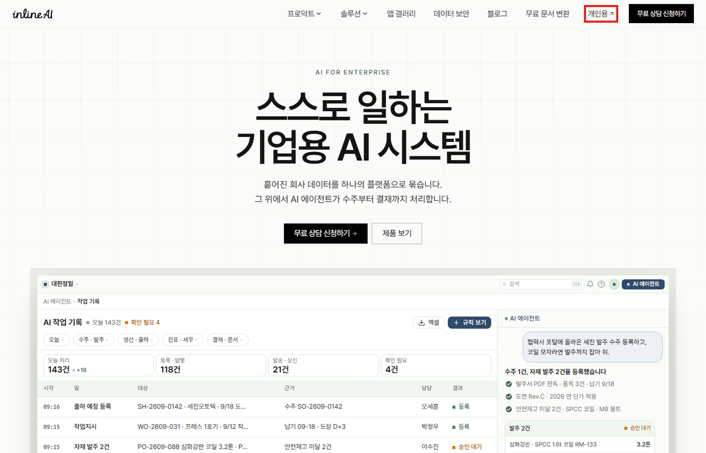
- 주의: 첫 화면의 '무료 상담 신청하기'는 기업 상담 신청이에요. 누르지 않아도 돼요.

**1-2. 개인용 페이지에서 내려받기** — `inline-ai.com/personal/` 에서 **Windows용 다운로드** 를 누르면 설치 파일(`inline-ai-v0.4.6-win-x64.exe`)이 내려받아져요.
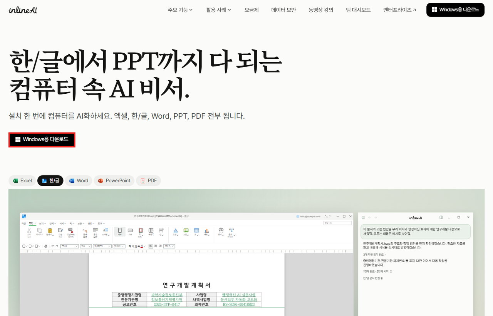
- 주의: Windows 전용이에요. 맥은 [확인 필요]. 학교 PC는 설치 권한이 막혀 있을 수 있어요.

**1-3. 설치·로그인** — 내려받은 파일을 두 번 눌러 설치하고, 계정으로 로그인해요. [캡처 필요: 설치 마법사·로그인 화면 — 이미 설치·로그인된 PC라 찍지 못함]
- 주의: 처음 가입하면 Free 플랜이에요(아래 7-4 크레딧 참고).

---

## 2. 첫 화면 살펴보기

**2-1. 홈 화면** — 왼쪽은 메뉴와 지난 대화, 가운데는 입력창, 아래는 자주 쓰는 일 버튼이에요.
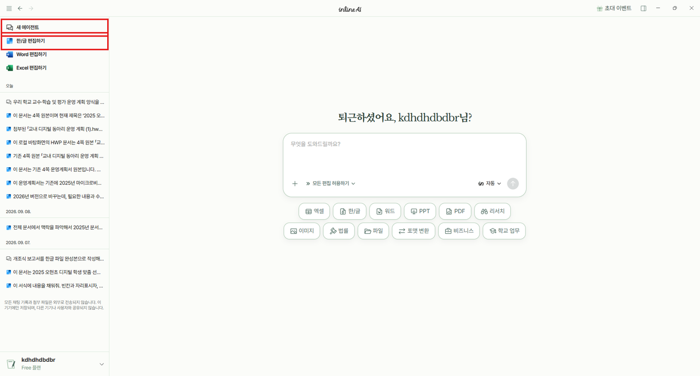
- 왼쪽 위 **새 에이전트**: 새 대화 시작(누르면 홈 화면과 같은 빈 입력창이 나와요).
- **한/글 편집하기 · Word 편집하기 · Excel 편집하기**: 해당 문서를 옆에 띄워 놓고 고치는 전용 창이 열려요.
- 주의: 왼쪽 아래 문구대로 "모든 채팅 기록과 첨부 파일은 이 기기에만 저장"돼요. 다른 PC에서는 기록이 안 보여요.

**2-2. 한/글 편집 모드 창** — **한/글 편집하기** 를 누르면 오른쪽에 좁은 창(`inline AI - 한/글 편집 모드`)이 따로 떠요. 한글 문서 옆에 붙여 두고 써요.
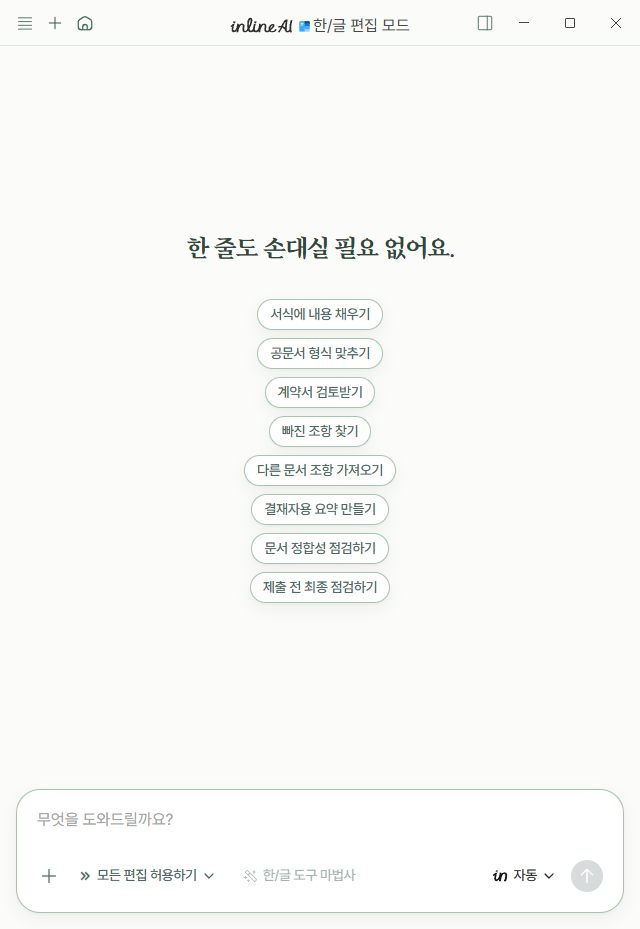
- 가운데 버튼: 서식에 내용 채우기 · 공문서 형식 맞추기 · 계약서 검토받기 · 빠진 조항 찾기 · 다른 문서 조항 가져오기 · 결재자용 요약 만들기 · 문서 정합성 점검하기 · 제출 전 최종 점검하기
- 입력창 아래에 **한/글 도구 마법사** 가 하나 더 있어요(한글 문서가 열려 있을 때 켜짐 [확인 필요]).
- 주의: 이 버튼들도 아래 5번 템플릿처럼 **누르면 바로 보내질 수 있어요** [확인 필요]. 연수 중엔 직접 한 줄로 쓰게 하세요.

---

## 3. 한 줄로 시키기 (입력창)

**3-1. 입력창에 쓰기** — "무엇을 도와드릴까요?" 칸에 한 줄로 써요. 오른쪽 아래 동그란 화살표(**보내기**)를 누르면 시작해요.
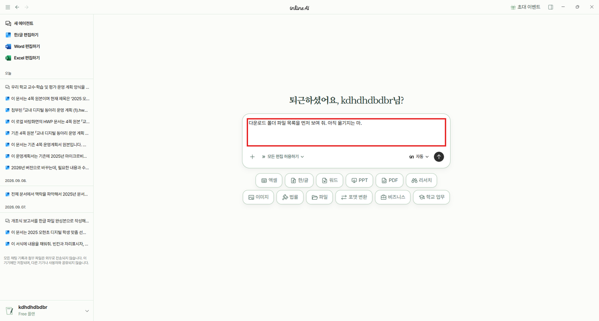
- 예시: `다운로드 폴더 파일 목록을 먼저 보여 줘. 아직 옮기지는 마.`
- 주의: "목록 먼저, 아직 하지 마"를 붙이면 AI가 바로 바꾸지 않고 계획부터 보여 줘요.

**3-2. 파일·폴더 붙이기 (+)** — 입력창 왼쪽 아래 **+** 를 누르면 **파일 첨부하기**(메시지에 파일을 첨부합니다) / **폴더 첨부하기**(메시지에 폴더를 첨부합니다)가 나와요.
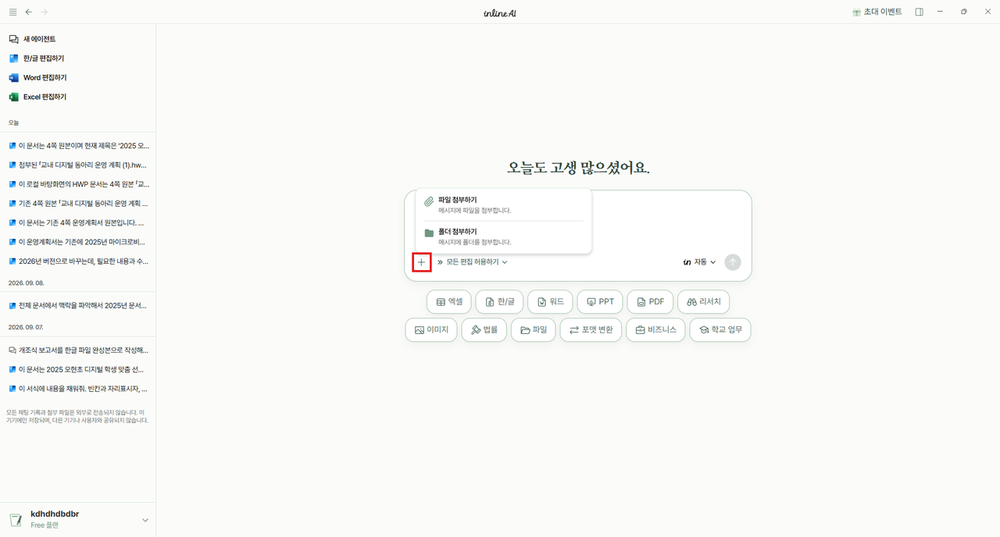
- 주의: 실습 폴더는 '폴더 첨부하기'로 통째로 붙이면 편해요.

---

## 4. 안전하게 쓰기 — 승인 모드와 모델

**4-1. 승인 모드 바꾸기** — 입력창 아래 **» 모든 편집 허용하기 ⌄** 를 누르면 두 가지가 나와요.
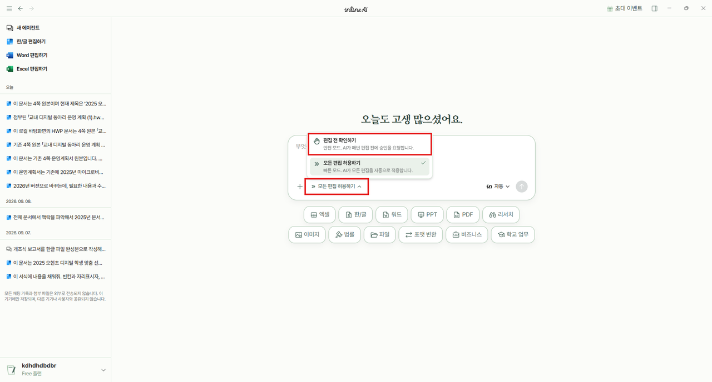
- **편집 전 확인하기** — AI가 매번 편집 전에 승인을 요청합니다.
- **모든 편집 허용하기** — 빠른 모드. AI가 모든 편집을 자동으로 적용합니다.
- 연수 설정: **모든 편집 허용하기** 그대로 둡니다(실습이 끊기지 않게). 대신 작업 패널의 '접근 가능한 폴더'에는 **inlineAI_실습 하나만** 등록하세요(바탕화면 전체·다운로드 폴더 금지).

**4-2. AI 모델 고르기** — 입력창 오른쪽 아래 **자동 ⌄** 를 누르면 모델 목록이 나와요.
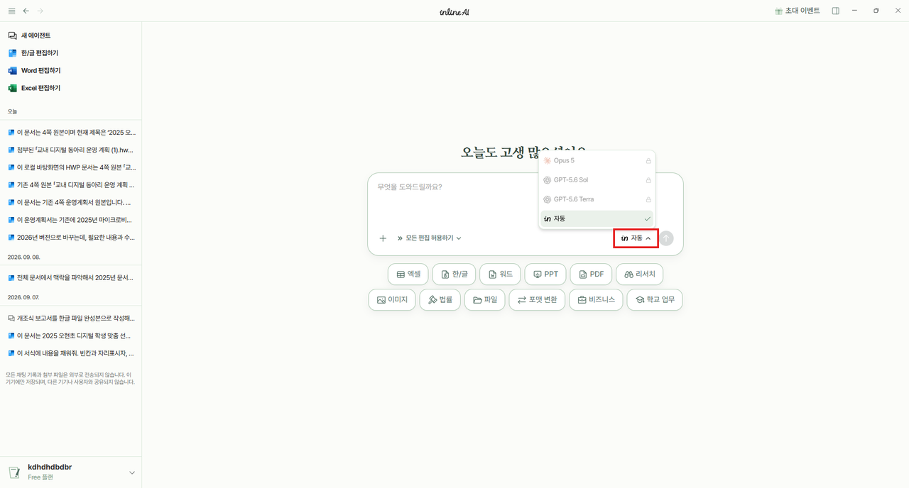
- 목록(10/5 화면): Opus 5 · GPT-5.6 Sol · GPT-5.6 Terra · 자동
- 주의: Free 플랜에서는 자동만 쓸 수 있어요(나머지에 자물쇠 표시). 그냥 **자동** 으로 두세요.

---

## 5. 작업 패널 — 내 컴퓨터에 초대하기

**5-1. 작업 패널 열기** — 오른쪽 위 네모 아이콘(**작업 패널 열기/닫기**)을 누르면 오른쪽에 패널이 열려요.
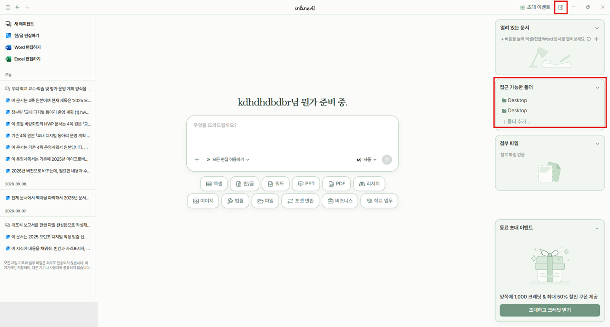
- **열려 있는 문서**: "+ 버튼을 눌러 엑셀/한글/Word 문서를 열어보세요"
- **접근 가능한 폴더**: AI가 들어가 볼 수 있는 폴더 목록(빨간 네모). **폴더 추가...** 로 늘려요.
- **첨부 파일**: 지금 대화에 붙인 파일
- 주의: 폴더를 넓게(예: C드라이브 전체) 열지 말고 실습 폴더만 추가하세요.

**5-2. 폴더 추가하기** — **폴더 추가...** 를 누르면 '작업 폴더 선택' 창이 떠요. 실습 폴더를 고르고 **폴더 선택** 을 눌러요.

- 주의: 이 캡처는 확인만 하고 '취소'로 닫았어요. 연수 때는 `materials` 폴더를 고르게 안내하세요.

---

## 6. 일 버튼(템플릿)

**6-1. 홈 화면 일 버튼** — 입력창 아래: 엑셀 · 한/글 · 워드 · PPT · PDF · 리서치 · 이미지 · 법률 · 파일 · 포맷 변환 · 비즈니스 · 학교 업무
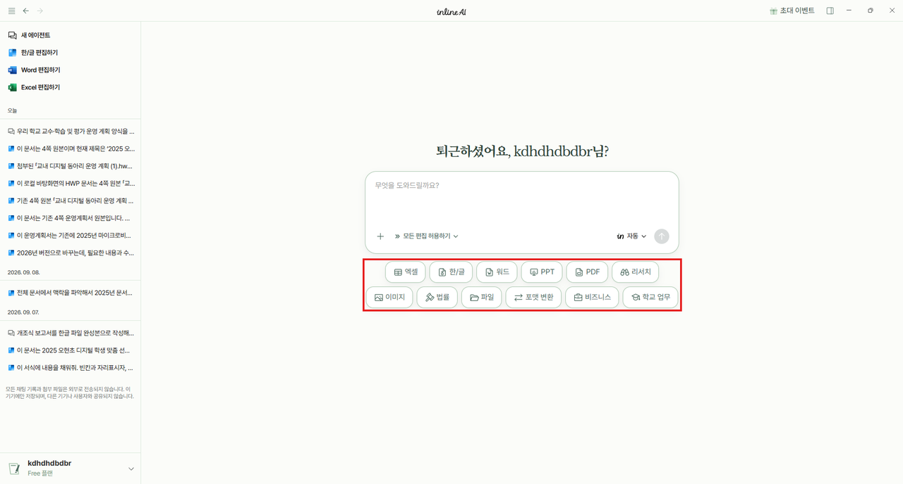

**6-2. 학교 업무 목록** — **학교 업무** 를 누르면 예시 일 목록이 펼쳐져요.
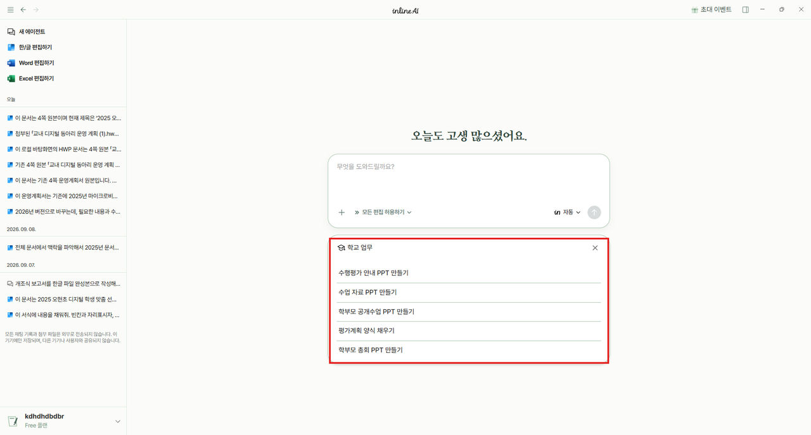
- 목록(10/5 화면): 수행평가 안내 PPT 만들기 · 수업 자료 PPT 만들기 · 학부모 공개수업 PPT 만들기 · 평가계획 양식 채우기 · 학부모 총회 PPT 만들기

**6-3. ⚠ 목록 항목을 누르면 바로 보내져요** — 항목 하나를 누르자 긴 예시 문장이 입력창에 들어가는 게 아니라 **곧바로 전송·실행**됐어요(크레딧 사용).
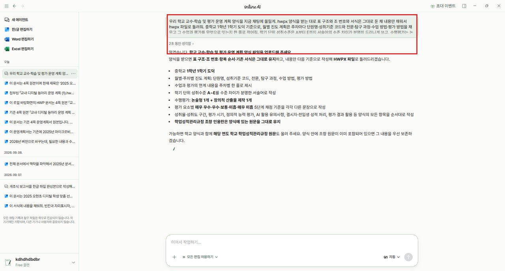
- 주의: 연수에서는 "목록은 구경만, 누르지 마세요"라고 안내하세요. 예시가 궁금하면 강사 화면으로 보여 주기.

---

## 7. 설정

**7-1. 설정 들어가기** — 왼쪽 아래 계정 이름을 누르면 메뉴가 떠요: 설정 · 문의하기 · 서비스 오류 제보 · 로그아웃. **설정** 을 눌러요.
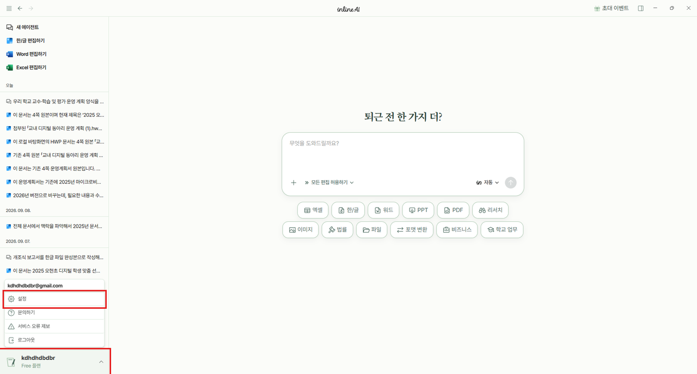
- 주의: 바로 아래가 **로그아웃** 이에요. 잘못 누르지 않게 조심.

**7-2. 일반 설정 — inline AI 지시사항** — 설정 왼쪽 메뉴: 일반 설정 · 계정 설정 · 결제 설정 · 크레딧 보기. **inline AI 지시사항** 칸에 쓴 내용은 "모든 대화에 적용"돼요.
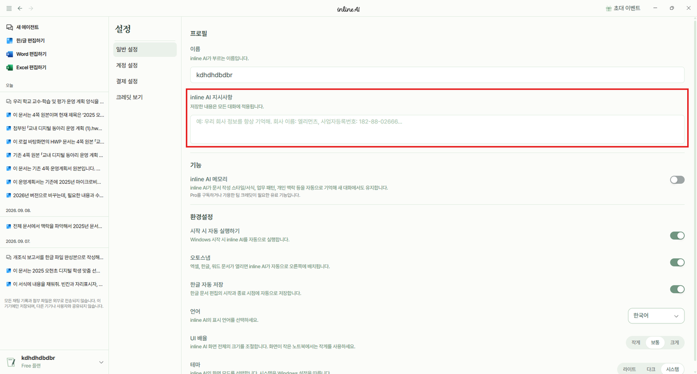
- 활용: `materials/00_하네스_공문서/01_메타프롬프트_짧은판.txt` 내용을 여기에 붙여 넣으면 매번 같은 규칙으로 써 줘요.
- 같은 화면 '기능' → **inline AI 메모리**: "Pro를 구독하거나 가용한 팀 크레딧이 필요한 유료 기능입니다."
- 주의: 지시사항은 저장하는 순간 모든 대화에 적용돼요. 연수 끝나면 지워도 돼요.

**7-3. 환경설정 — 자동 실행·오토스냅·한글 자동 저장**
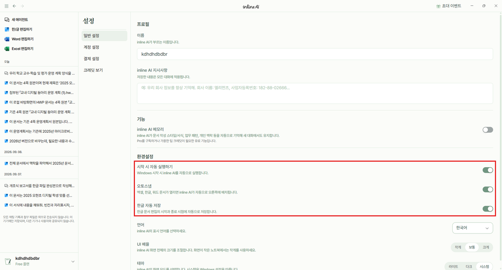
- **시작 시 자동 실행하기**: Windows 시작 시 inline AI를 자동으로 실행합니다.
- **오토스냅**: 엑셀, 한글, 워드 문서가 열리면 inline AI가 자동으로 오른쪽에 배치됩니다.
- **한글 자동 저장**: 한글 문서 편집의 시작과 종료 시점에 자동으로 저장합니다.
- 그 아래: 언어(한국어) · UI 배율(작게/보통/크게) · 테마(라이트/다크/시스템)
- 주의: 한글 자동 저장이 켜져 있으면 원본이 바로 바뀌어요. 실습 전에 **원본을 복사**해 두세요.

**7-4. 크레딧 보기** — 남은 크레딧과 다시 채워지는 날짜가 나와요.
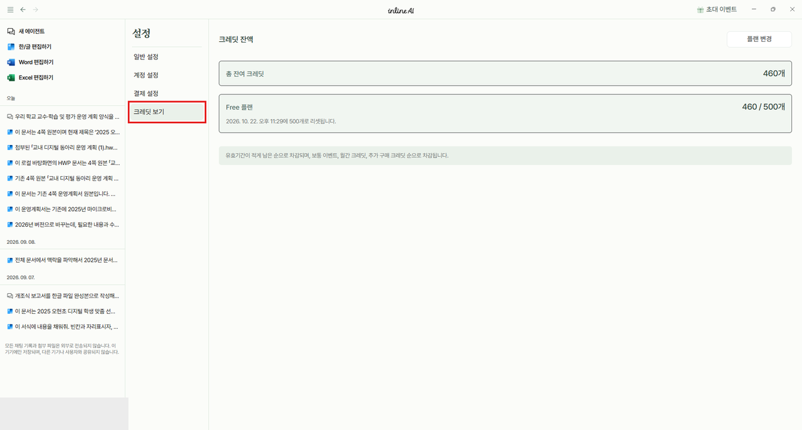
- 10/5 화면: Free 플랜 460 / 500개, "2026. 10. 22. 오후 11:29에 500개로 리셋됩니다."
- 차감 순서: 유효기간이 적게 남은 순 — 보통 이벤트 → 월간 크레딧 → 추가 구매 크레딧
- 주의: 메시지 한 번에 몇 크레딧이 드는지는 [확인 필요]. 리셋 날짜는 계정마다 달라요.

**7-5. 계정 설정** — 로그인한 이메일, 로그아웃, 계정 삭제 안내(고객센터 문의)가 있어요.
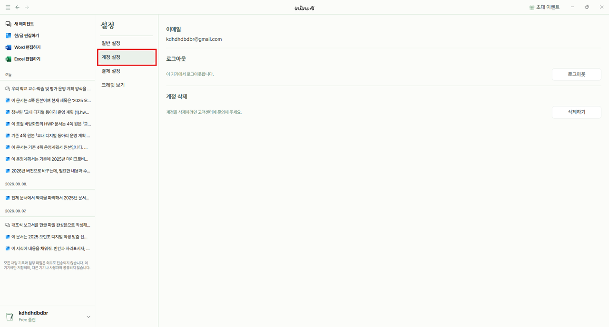
- 주의: 여기서는 아무것도 누르지 않아요.
- 결제 설정 화면은 결제 정보가 있을 수 있어 찍지 않았어요.

---

## 8. 결과 확인 — 수락/거절

**8-1. 질문하며 계획 세우기 → 이어서 작업하기** — "나에게 물으면서 계획을 세워"라고 시키면 질문(Q/A)을 주고받은 뒤, 마지막에 **이어서 작업하기** 카드가 나와요. 이 버튼을 눌러야 실제 문서 수정이 시작돼요.
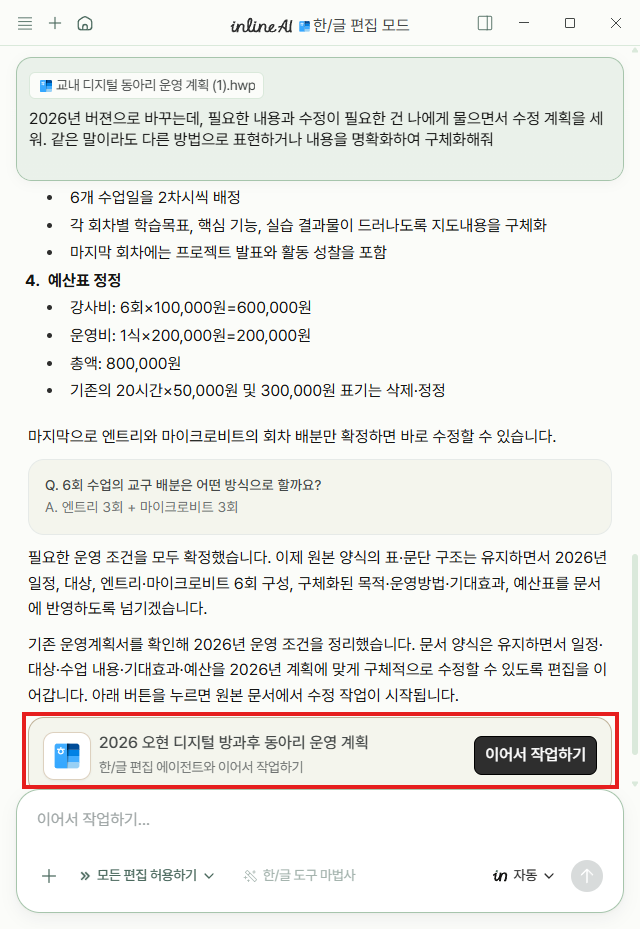
- 주의: '이어서 작업하기' 전까지는 문서가 바뀌지 않아요. 계획을 먼저 읽고 누르세요.

**8-2. 편집 수락/거절** — (연수는 '모든 편집 허용하기'라 거의 안 뜸) '편집 전 확인하기' 모드에서 실제 편집을 시켜야 수락/거절 화면이 나와요. 메시지 전송(크레딧 사용)이 필요해 이번에는 찍지 않았어요. 강의 리허설 때 1번 실습(다운로드 정리)으로 찍기를 권해요.

---

## 확인한 실제 메뉴 이름 (2026. 10. 5.)

| 위치 | 이름 |
|---|---|
| 왼쪽 위 | 사이드바 열기/닫기, 뒤로 가기, 앞으로 가기 |
| 왼쪽 메뉴 | 새 에이전트, 한/글 편집하기, Word 편집하기, Excel 편집하기 |
| 위쪽 | 홈으로 이동(inline AI 로고), 초대 이벤트, 작업 패널 열기/닫기 |
| 입력창 | 무엇을 도와드릴까요?, 파일 및 폴더 첨부하기(+), 승인 모드 전환하기, AI 모델 변경하기, 보내기 |
| + 메뉴 | 파일 첨부하기, 폴더 첨부하기 |
| 승인 모드 | 편집 전 확인하기, 모든 편집 허용하기 |
| 모델 | Opus 5, GPT-5.6 Sol, GPT-5.6 Terra, 자동 |
| 일 버튼 | 엑셀, 한/글, 워드, PPT, PDF, 리서치, 이미지, 법률, 파일, 포맷 변환, 비즈니스, 학교 업무 |
| 학교 업무 | 수행평가 안내 PPT 만들기, 수업 자료 PPT 만들기, 학부모 공개수업 PPT 만들기, 평가계획 양식 채우기, 학부모 총회 PPT 만들기 |
| 작업 패널 | 열려 있는 문서(새로고침, 문서 파일 열기), 접근 가능한 폴더(폴더 추가...), 첨부 파일, 동료 초대 이벤트 |
| 계정 메뉴 | 설정, 문의하기, 서비스 오류 제보, 로그아웃 |
| 설정 | 일반 설정, 계정 설정, 결제 설정, 크레딧 보기 |
| 일반 설정 | 이름, inline AI 지시사항, inline AI 메모리, 시작 시 자동 실행하기, 오토스냅, 한글 자동 저장, 언어, UI 배율, 테마 |
| 한/글 편집 모드 창 | 세션 목록, 새 에이전트, 홈으로 돌아가기, 작업 패널 열기/닫기, 한/글 도구 마법사, 이어서 작업하기 |

---

## 모드별 화면 (2026. 10. 5. 다시 찍음)

> 이미지: `assets/shot/inline/modes/` — `이름.png` 원본, `이름_1280.png` 강의용(빨간 네모 + 번호 배지). 계정 이름이 보이는 곳은 회색으로 덮었어요.

> ⚠ **목록·일 버튼(예: "급여대장 만들기", "서식에 내용 채우기")은 누르는 순간 바로 보내지고 실행돼요(크레딧 사용).** 연수에서는 "구경만" 하게 하고, 시킬 일은 입력창에 직접 한 줄로 쓰게 하세요.

### M-1. 홈 화면 한눈에 보기

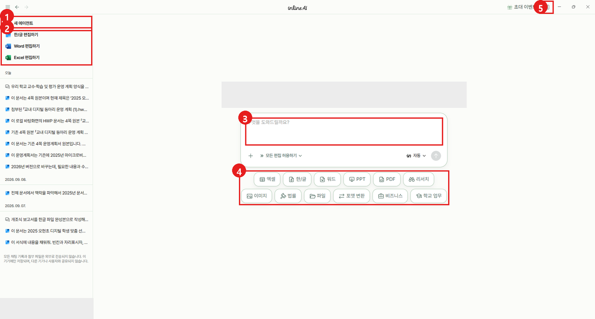

① 새 에이전트(새 대화) ② 편집 모드 3종(한/글·Word·Excel 편집하기) ③ 입력창 ④ 분류 버튼 12종 ⑤ 작업 패널 열기/닫기

### M-2. 편집 모드 3종

사이드바의 **한/글 편집하기 · Word 편집하기 · Excel 편집하기** 를 누르면 메인 창은 그대로 두고, 오른쪽에 좁은 전용 창(`inline AI - HWP Edit` / `Word Edit` / `Excel Edit`)이 따로 떠요. 문서 옆에 붙여 두고 쓰는 모드예요.

| 모드 | 창 제목 | 가운데 일 버튼(누르면 바로 실행) | 전용 도구 |
|---|---|---|---|
| 한/글 편집 모드 | inline AI 한/글 편집 모드 | 서식에 내용 채우기 · 공문서 형식 맞추기 · 계약서 검토받기 · 빠진 조항 찾기 · 다른 문서 조항 가져오기 · 결재자용 요약 만들기 · 문서 정합성 점검하기 · 제출 전 최종 점검하기 | **한/글 도구 마법사**(입력창 아래, 한글 문서를 인식했을 때만 켜짐 — 10/5엔 꺼져 있음) |
| Word 편집 모드 | inline AI Word 편집 모드 | 템플릿에 내용 채우기 · 계약서 검토받기 · 빠진 조항 찾기 · 다른 계약서 조항 가져오기 · 계약서 핵심만 보고받기 · 서명 전 문서 점검하기 · 산업 개요 섹션 쓰기 | 없음 |
| Excel 편집 모드 | inline AI Excel 편집 모드 | 데이터 분석하고 인사이트 뽑기 · 대시보드 시트 만들기 · 어울리는 차트 그리기 · 피벗으로 요약하기 · 데이터 정리하기 · 필요한 수식 만들어 넣기 · 두 목록 대조하기 · 보고서용으로 다듬기 | 없음 |

세 모드 공통 창 위쪽: **세션 목록**(≡, 지난 대화 목록) · **새 에이전트**(+) · **홈으로 돌아가기**(집) · **작업 패널 열기/닫기**. 입력창 아래: + · 승인 모드 · 모델.

**한/글 편집 모드**

- 들어가기: 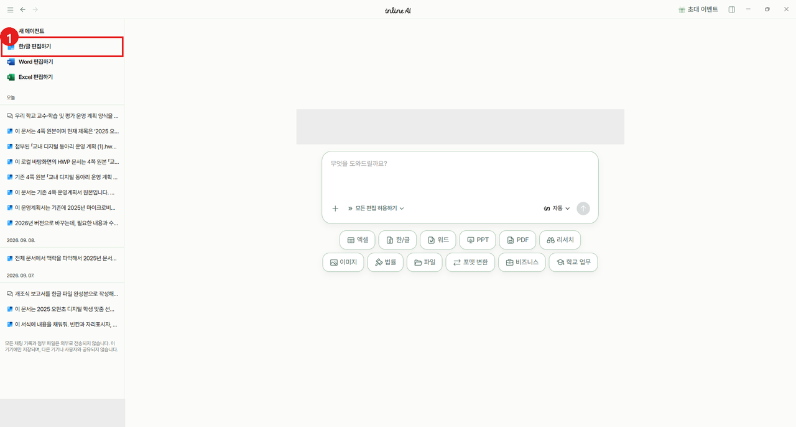
- 창 구성 (①세션 목록 ②새 에이전트 ③홈으로 돌아가기 ④작업 패널 ⑤승인 모드 ⑥한/글 도구 마법사): 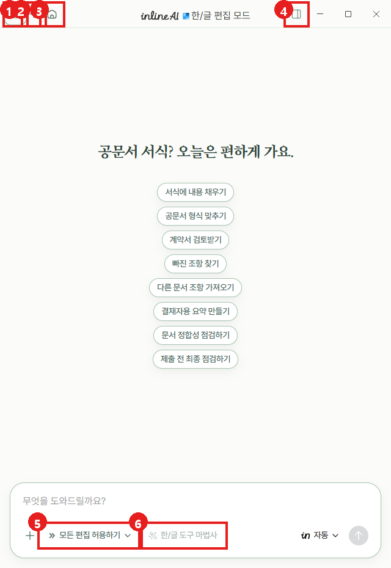
- 세션 목록 펼침: 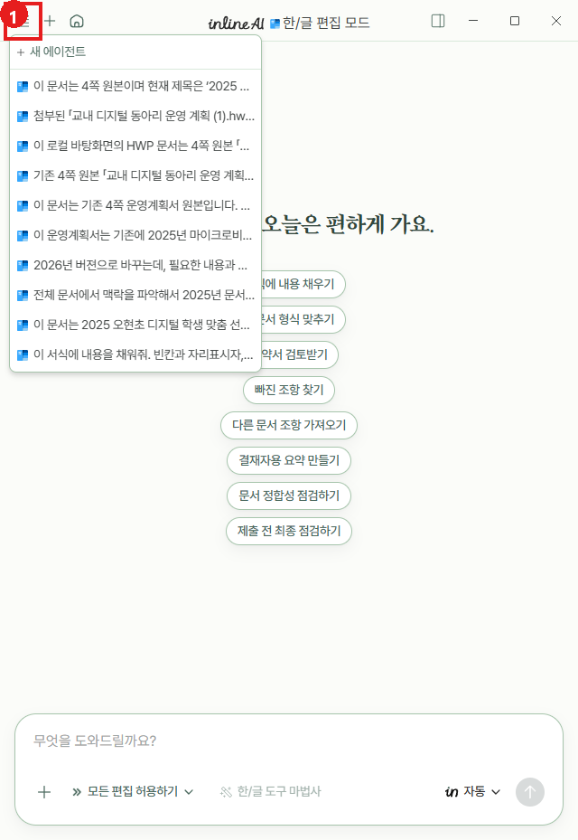
- 작업 패널 펼침: 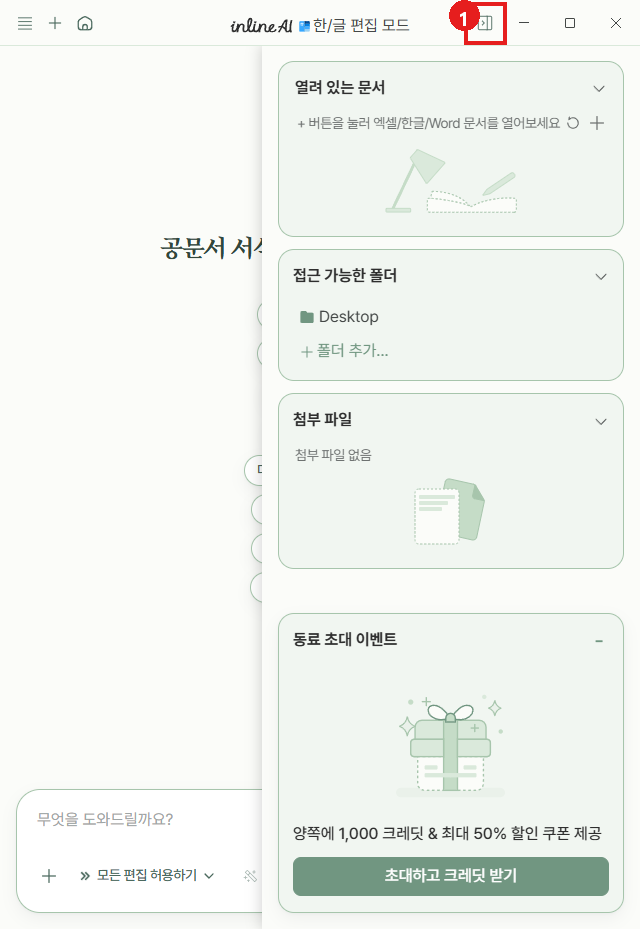

**Word 편집 모드**

- 들어가기: 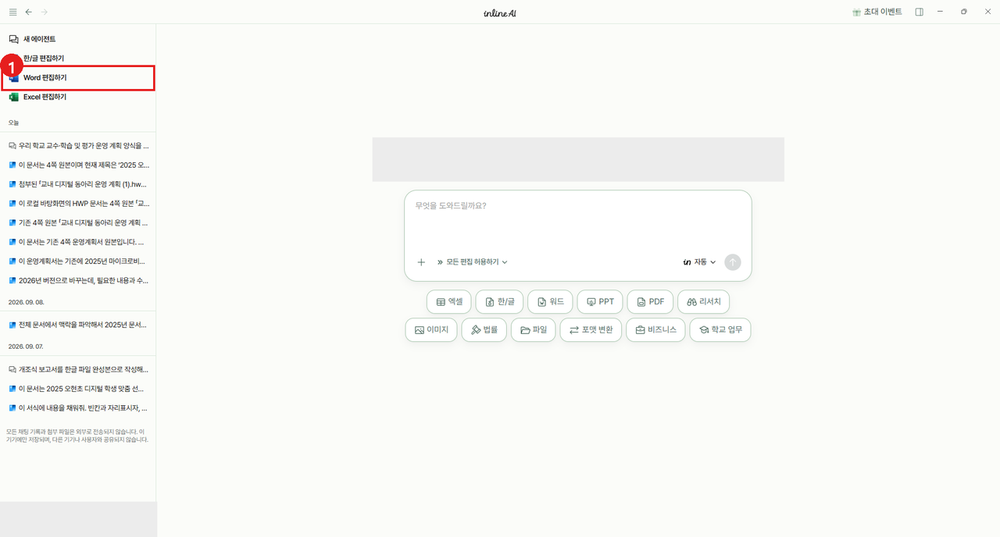
- 창 구성 (①세션 목록 ②새 에이전트 ③홈으로 돌아가기 ④작업 패널 ⑤승인 모드): 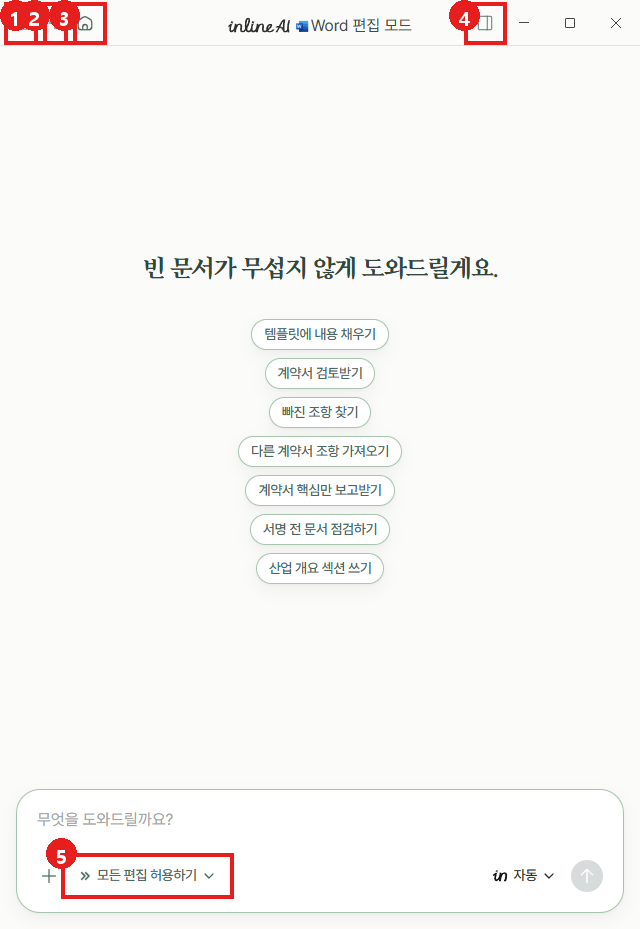
- 세션 목록 펼침: 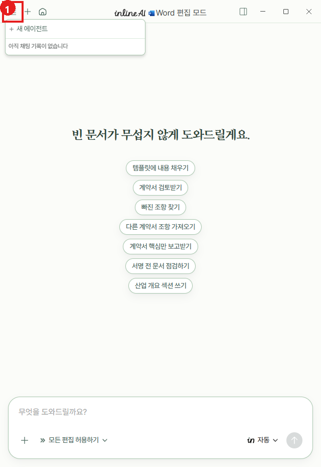
- 작업 패널 펼침: 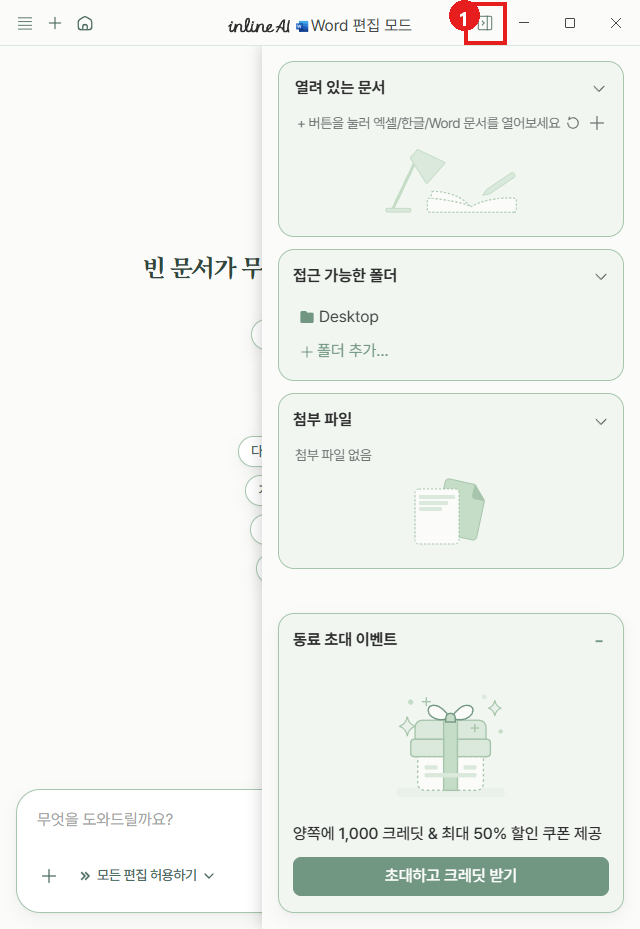

**Excel 편집 모드**

- 들어가기: 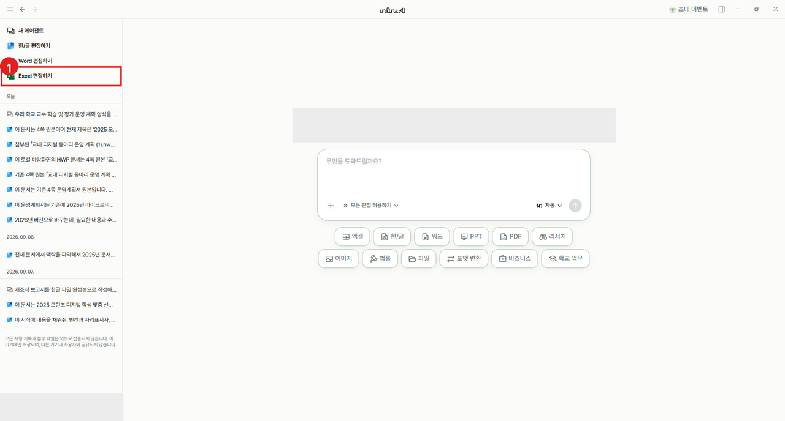
- 창 구성 (①세션 목록 ②새 에이전트 ③홈으로 돌아가기 ④작업 패널 ⑤승인 모드): 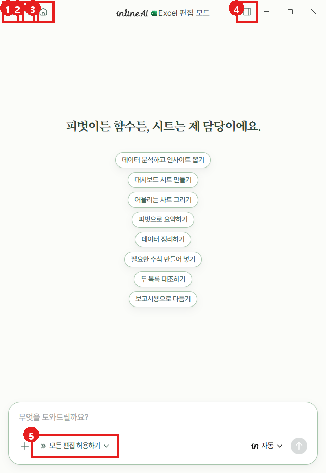
- 세션 목록 펼침: 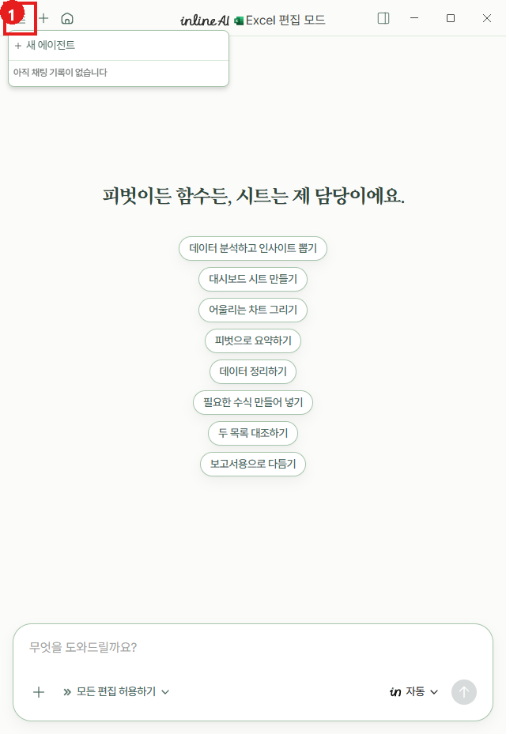
- 작업 패널 펼침: 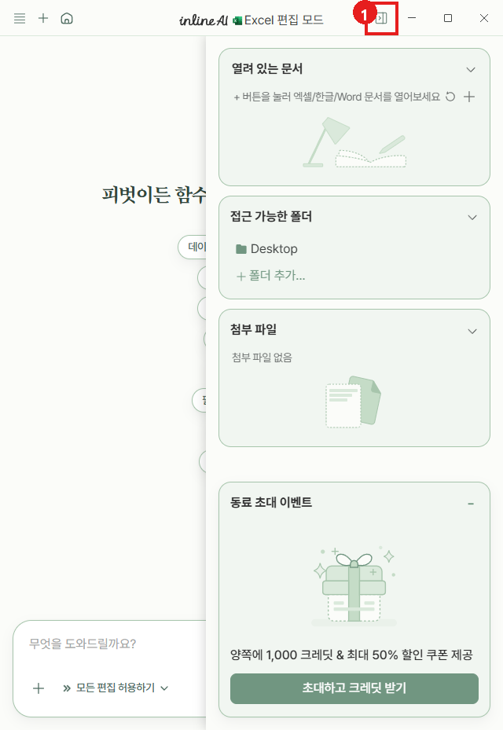

### M-3. 문서를 열었을 때 — "현재 보고 있는 문서"

엑셀 파일(실습 사본 `체험학습_예산표.xlsx`)을 열어 두면 inline AI가 알아서 알아봐요.

**메인 창**: 작업 패널 **열려 있는 문서 → 활성 문서** 에 파일 이름이 뜨고(①), 입력창 바로 위에도 "현재 보고 있는 문서"가 붙어요(②).
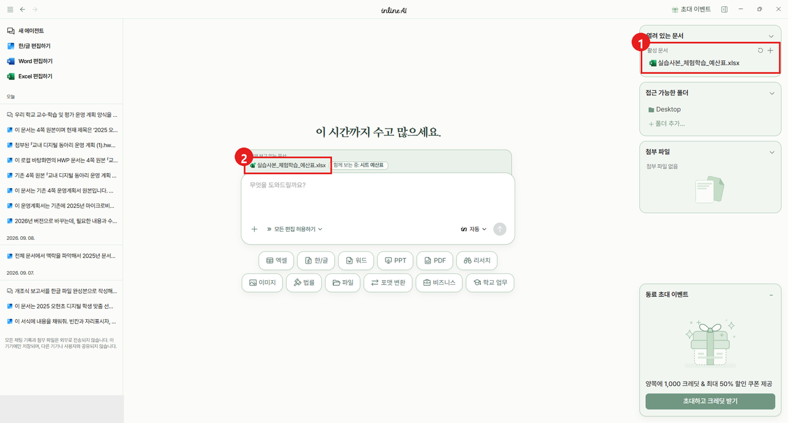

**Excel 편집 모드 창**: 입력창 위에 "현재 보고 있는 문서: 실습사본_체험학습_예산표.xlsx · 함께 보는 중: 시트 예산표"(①).
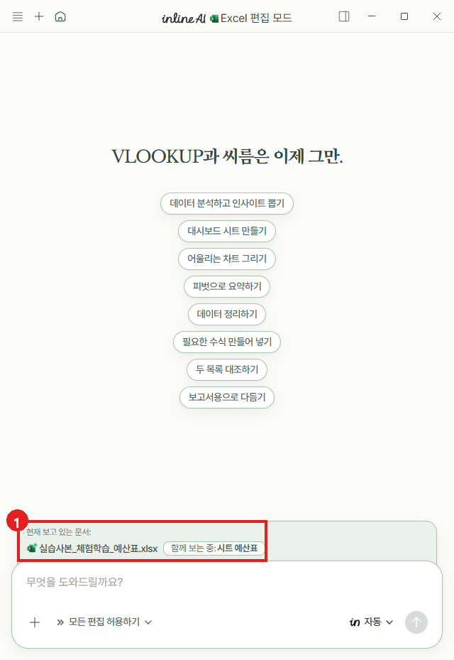
엑셀 옆에 띄운 모습:
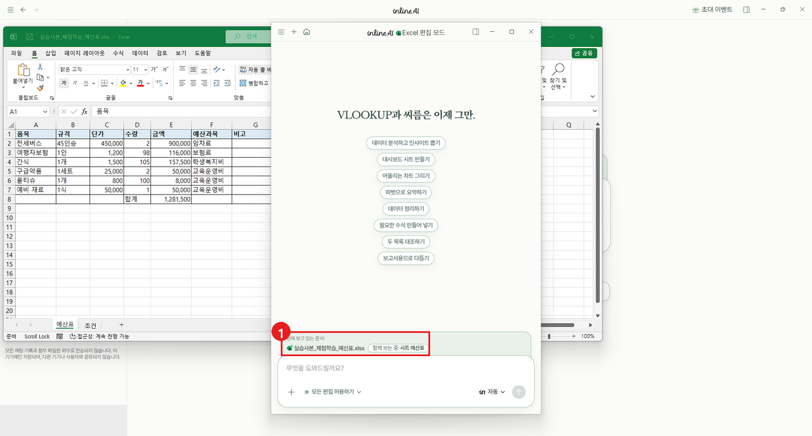
- 주의: 이 상태에서 "이 표 합계 맞는지 봐 줘"처럼 쓰면 **지금 열린 문서**를 대상으로 일해요. 원본이 아니라 사본을 열어 두세요.
- [캡처 필요] **한글(hwpx) 문서 인식 화면**: 실습 사본 hwpx를 열었지만 10/5 강사 PC에서는 "열려 있는 문서"에 나타나지 않았어요(한/글 도구 마법사도 꺼진 채). 다른 프로그램이 한글 자동화를 쓰고 있었던 탓일 수 있어요 [확인 필요]. 강의 리허설 때 다시 찍기.
- [캡처 필요] **오토스냅**(문서를 열면 inline AI가 오른쪽에 자동 배치): 설정은 켜져 있었지만 이번엔 자동 배치가 일어나지 않았어요(메인 창이 최대화 상태). 리허설 때 확인.

### M-4. 작업 패널 상태

| 상태 | 화면 |
|---|---|
| 열린 문서 없음 + 접근 가능한 폴더 등록됨(Desktop) | 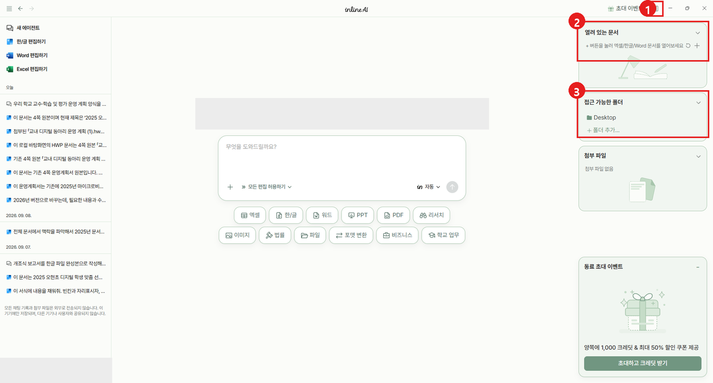 |
| 열린 문서 있음(엑셀 사본) |  |
| 접근 가능한 폴더 **비어 있음** | [캡처 필요] — 이미 등록된 폴더를 지워야 해서(설정 변경) 찍지 않았어요. 처음 설치한 선생님 PC에서 찍기. |

### M-5. 승인 모드 2종 · 모델

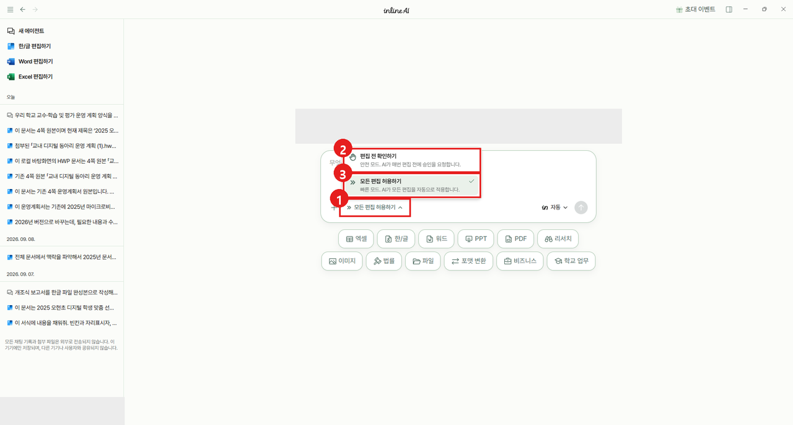
① 승인 모드 버튼 ② **편집 전 확인하기**(안전 모드 — AI가 매번 편집 전에 승인을 요청) ③ **모든 편집 허용하기**(빠른 모드 — 자동 적용). 연수에서는 ②.

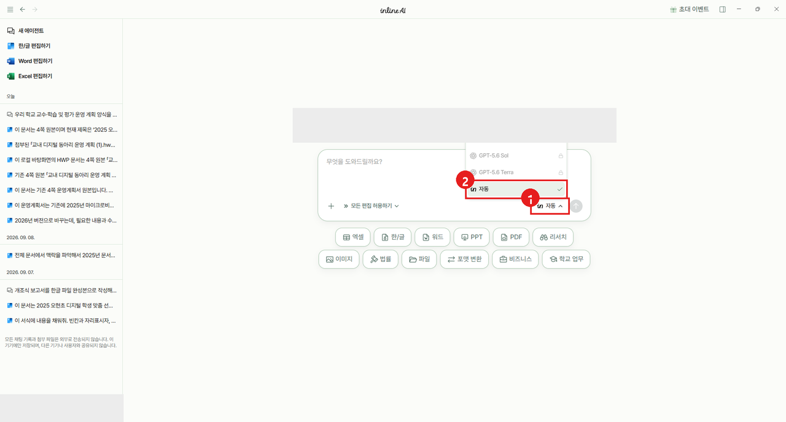
① 모델 버튼 ② **자동** — Free 플랜은 자동만 쓸 수 있어요(Opus 5 · GPT-5.6 Sol · GPT-5.6 Terra는 자물쇠).

### M-6. 분류 버튼 12종 — 무엇을 바로 시킬 수 있나

분류 버튼을 누르면 입력창 아래에 예시 일 목록이 펼쳐져요. 그림의 ①은 목록(**보기만, 누르면 바로 실행**), ②는 닫기(X)예요. 목록이 길면 안에서 스크롤돼요(그림엔 앞부분만 보임).

| 분류 | 개수 | 목록 항목(화면 그대로) | 학교에서 쓸 만한 것 | 화면 |
|---|---|---|---|---|
| 엑셀 | 20 | 급여대장 만들기 · 매출 대시보드 만들기 · 피벗으로 데이터 요약하기 · 실적 히트맵 만들기 · 간트 차트로 일정 짜기 · 사건 관리대장 만들기 · 근태 관리표 만들기 · 견적서 양식 만들기 · 부가세 집계표 만들기 · 성적 관리표 만들기 · 오늘 시장 브리핑 시트 만들기 · 현금흐름·런웨이 시트 만들기 · 타임시트 만들기 · 연차 관리대장 만들기 · 연구비 집행 관리표 만들기 · 입력 실수 막는 양식 만들기 · 손익계산서 틀 만들기 · 업무 진행 현황판 만들기 · 데이터에 맞는 차트 고르기 · 의뢰인 관리대장 만들기 | 성적 관리표 만들기, 연차 관리대장 만들기, 입력 실수 막는 양식 만들기 |  |
| 한/글 | 20 | 공문 작성하기 · 보도자료 작성하기 · 오늘 뉴스 보고서 만들기 · 논문 작성하기 · 회의록 작성하기 · 소장 작성하기 · 답변서 작성하기 · 준비서면 작성하기 · 지급명령신청서 작성하기 · 조정신청서 작성하기 · 내용증명 작성하기 · 법률자문의뢰서 작성하기 · 채권가압류신청서 작성하기 · 직장내 괴롭힘 조사보고서 작성하기 · 용역계약서 작성하기 · 과업결과보고서 작성하기 · 개조식 보고서 작성하기 · 표준근로계약서 작성하기 · 프리랜서 계약서 작성하기 · 한 장 요약 보고서 만들기 | 공문 작성하기, 회의록 작성하기, 개조식 보고서 작성하기, 한 장 요약 보고서 만들기 | 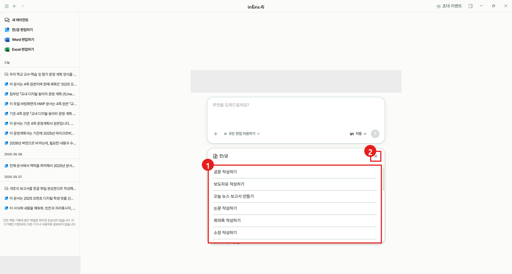 |
| 워드 | 20 | 사업 제안서 만들기 · 수업 활동지 만들기 · 시험 문제지 만들기 · 업무협약서(MOU) 작성하기 · 프로젝트 보고서 만들기 · 사내 뉴스레터 만들기 · NDA 작성하기 · 회사 소개서 만들기 · 사용자 매뉴얼 만들기 · 인수인계서 만들기 · 주간 상태 보고 만들기 · 영문 추천서 쓰기 · 논문 초안 틀 잡기 · 강의계획서 만들기 · 영문 비즈니스 레터 쓰기 · 영문 서비스 계약서 쓰기 · 행사 포스터 만들기 · 물품 공급계약서 작성하기 · 영문 보도자료 쓰기 · 리서치 브리핑 만들기 | 수업 활동지 만들기, 시험 문제지 만들기, 강의계획서 만들기, 인수인계서 만들기 | 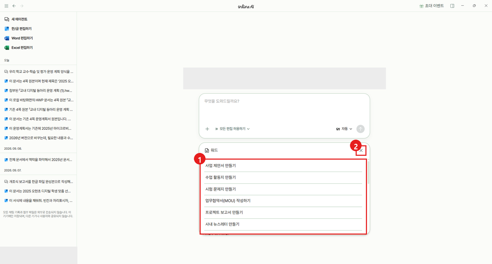 |
| PPT | 8 | 맥킨지 스타일 전략 PPT 만들기 · AI 산업 전망 PPT 만들기 · 신사업 진출 검토 PPT 만들기 · 수익성 개선 PPT 만들기 · 경쟁사 벤치마킹 PPT 만들기 · 디지털 전환 로드맵 PPT 만들기 · 투자심의 PPT 만들기 · 컨설팅 제안서 PPT 만들기 | (기업용 위주) | 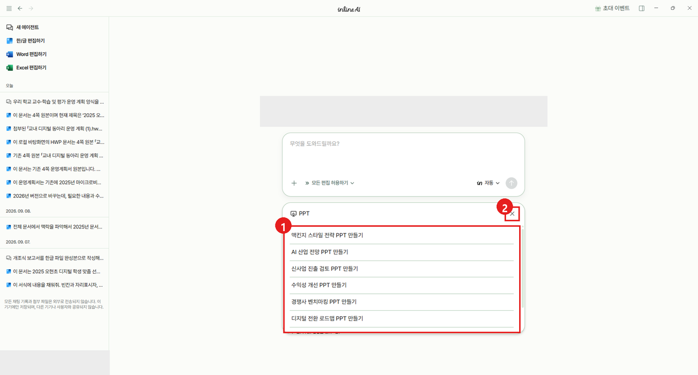 |
| PDF | 8 | 제안서 PDF 만들기 · 회사 소개서 PDF 만들기 · 리서치 보고서 PDF 만들기 · 한 장 요약 PDF 만들기 · 계약서 PDF 만들기 · 청구서 PDF 만들기 · 이력서 PDF 만들기 · 행사 안내문 PDF 만들기 | 행사 안내문 PDF 만들기 | 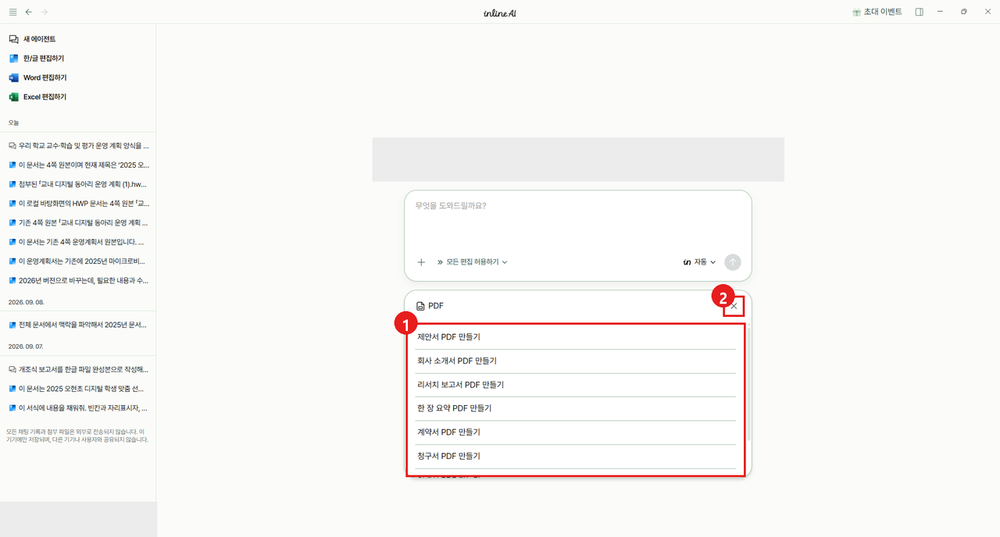 |
| 리서치 | 6 | 오늘 뉴스 브리핑 받기 · 환율·시세 확인하기 · 산업 동향 조사하기 · 딥 리서치 보고서 받기 · 경쟁사 조사하기 · 최신 논문 찾아보기 | 오늘 뉴스 브리핑 받기, 최신 논문 찾아보기 | 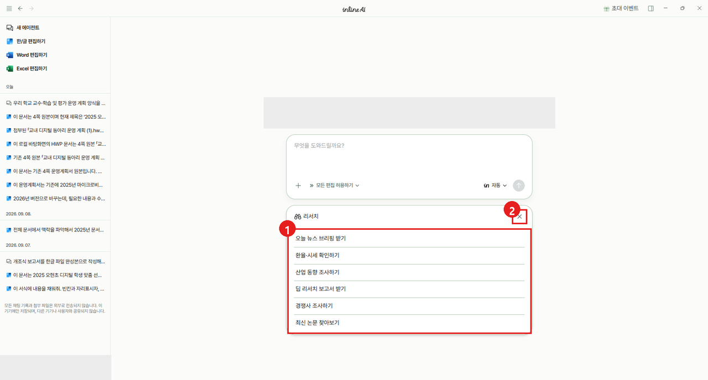 |
| 이미지 | 6 | 인포그래픽 만들기 · 프로세스 흐름도 그리기 · 발표 표지 이미지 만들기 · 블로그·소셜 썸네일 만들기 · 아이콘 세트 만들기 · 제품 콘셉트 이미지 만들기 | 인포그래픽 만들기, 발표 표지 이미지 만들기 |  |
| 법률 | 6 | 계약서 검토 받기 · 판례 찾아보기 · 법령·규정 찾아보기 · 어려운 조항 뜻 풀어보기 · 분쟁 절차 알아보기 · 상표·상호 확인하기 | 법령·규정 찾아보기 | 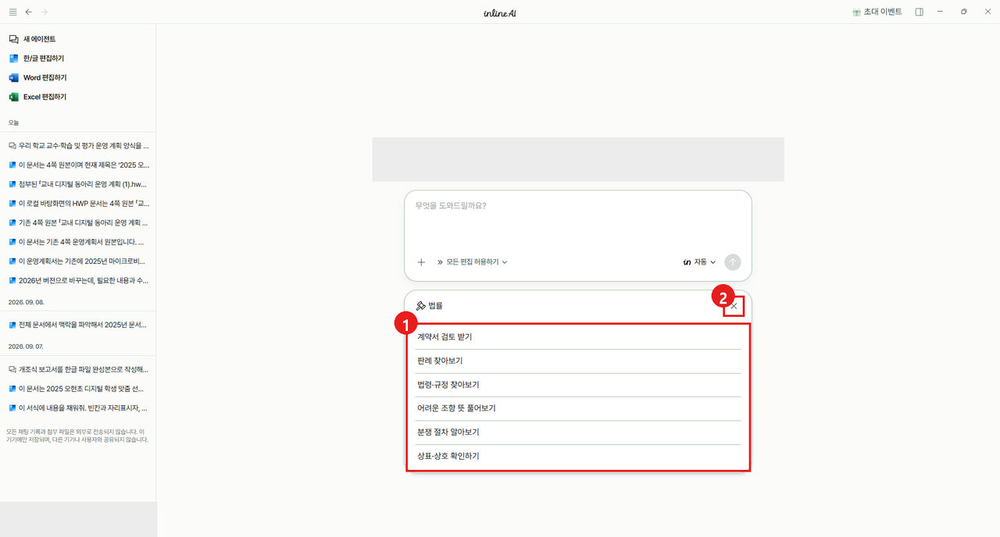 |
| 파일 | 6 | 다운로드 폴더 정리하기 · 컴퓨터에서 파일 찾기 · 폴더 통째로 요약받기 · 파일 이름 한번에 정리하기 · 중복 파일 찾아내기 · 프로젝트 폴더 구조 잡기 | 다운로드 폴더 정리하기, 파일 이름 한번에 정리하기, 중복 파일 찾아내기 |  |
| 포맷 변환 | 12 | 워드 → PDF · 엑셀 → PDF · 파워포인트 → PDF · 한/글 → PDF · PDF → 워드 · PDF → 엑셀 · PDF → 한/글 · 엑셀 → CSV · CSV → 엑셀 · PPT → PPTX · 한/글 → 워드 · 워드 → 한/글 | 한/글 → PDF, PDF → 한/글, 한/글 → 워드 | 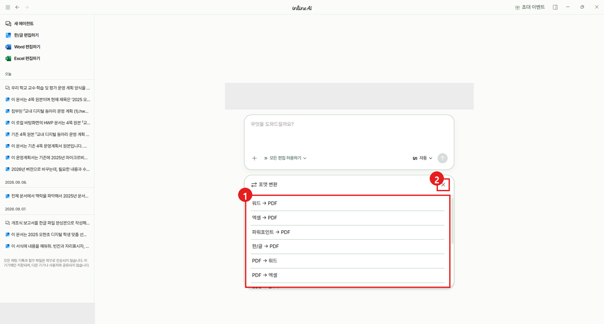 |
| 비즈니스 | 6 | 회의 준비하기 · 지원사업 공고 찾기 · 고객사 미팅 전 조사하기 · 가격 정책 비교하기 · 사업 아이디어 검증받기 · 프로젝트 리스크 점검하기 | 회의 준비하기 |  |
| 학교 업무 | 5 | 수행평가 안내 PPT 만들기 · 수업 자료 PPT 만들기 · 학부모 공개수업 PPT 만들기 · 평가계획 양식 채우기 · 학부모 총회 PPT 만들기 | 전부(5개) | 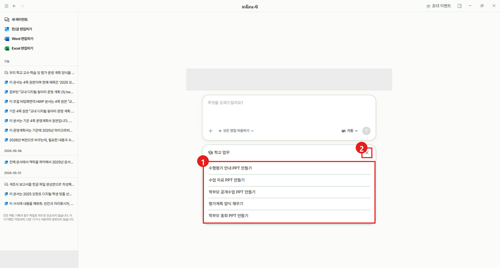 |

- 주의: 대부분 기업·법률용 예시예요. **학교 업무**(5개)와 **파일**, **포맷 변환**이 연수에 가장 가까워요. 한/글 분류의 "공문 작성하기"도 쓸 만해요.
