# 클로드(Claude) 데스크톱 앱 · 코워크 매뉴얼 (선생님용)

> 2026. 10. 5. 기준 · 이미지: `assets/shot/claude/` (`이름.png` 원본, `이름_1280.png` 강의용, 빨간 네모 = 누를 곳)
> 메뉴 이름은 2026. 10. 5. 강사 계정(로그인 상태) 화면에 보이는 그대로 적었어요.

## 먼저 알아 둘 것 (공식 안내 기준)

- 클로드 다운로드 페이지: "Chat is available on all plans, including Free. **Claude Code and Claude Cowork are available on Pro, Max, Team, and Enterprise.**" → 코워크는 **유료(Pro 이상)** 가 필요해요.
- 2026. 9. 16. 공지 「Claude Cowork is now just Claude」: 코워크와 채팅이 **하나의 Claude 화면으로 합쳐짐**. Pro·Max부터 몇 주에 걸쳐 적용, Team·Free는 뒤이어 적용 예정. 기존 채팅·프로젝트·아티팩트·커넥터·스킬은 그대로 같은 자리에 있어요. (출처: https://claude.com/blog/cowork-is-now-claude)
  - 10/5 강사 화면(Max)에는 입력창에 **채팅 / Cowork** 전환이 따로 보였어요. 계정·시기마다 다를 수 있어요. "클로드에게 폴더를 맡기는 것 = 코워크"라고 설명하세요. [확인 필요: 강의 전날 강사 계정 화면]
- 요금(원화·달러 금액)은 [확인 필요] — claude.com/pricing 에서 강의 전날 확인.

---

## 1. 설치 3단계

**1-1. 내려받기** — `claude.ai/download` 에서 **Windows용 다운로드** 를 눌러요.
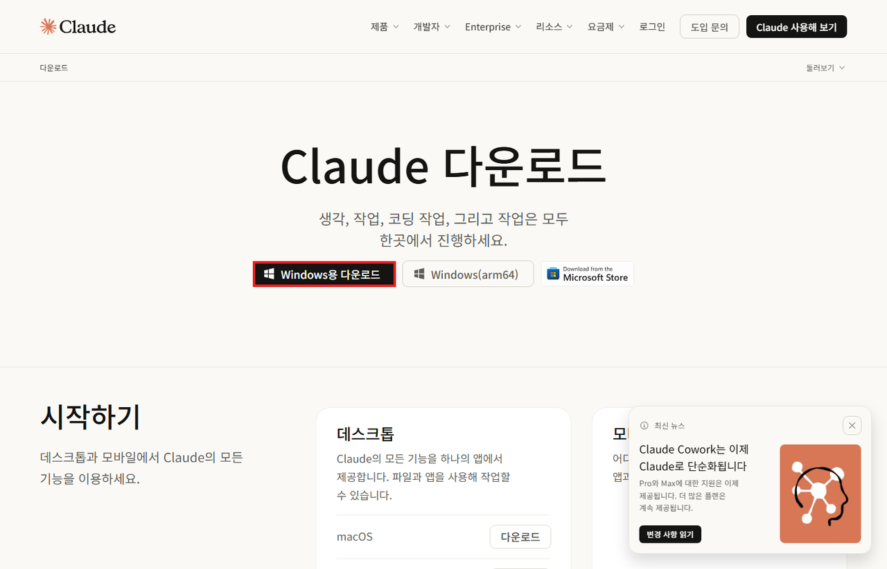
- 주의: 일반 PC는 'Windows용 다운로드', ARM 노트북(서피스 등)만 'Windows(arm64)'. Microsoft Store로도 받을 수 있어요.

**1-2. 설치 후 첫 화면** — 설치 파일을 실행하면 "Claude for Windows — Claude와 대화하는 가장 빠른 방법" 화면이 떠요. **시작하기** 를 눌러요.
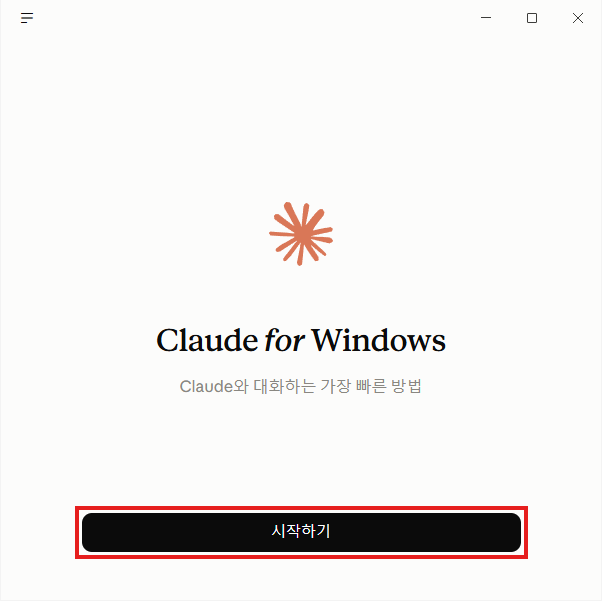

**1-3. 로그인** — **Google로 계속하기** 또는 이메일 입력 → **이메일로 계속하기**.
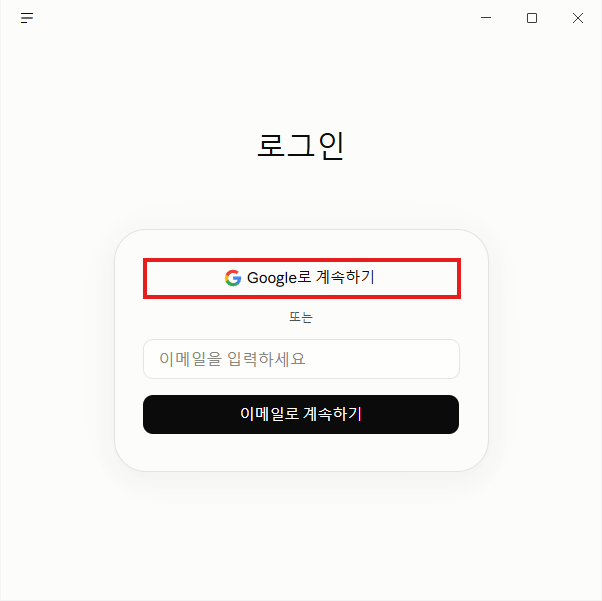
- 주의: 코워크를 쓰려면 이 계정이 **Pro 이상 유료 요금제**여야 해요. 무료 계정은 채팅만 돼요.

> 앱 왼쪽 위 ≡ 메뉴(로그인 전에도 보임): 파일 · 편집 · 보기 · 이동 · 도움말
> - 보기: 명령 팔레트…(Ctrl+K) · 패널 닫기(Ctrl+\) · 분할 보기 · 실제 크기 · 확대 · 축소 · 새로고침(F5)
> - 이동: 뒤로 · 앞으로 · 이전 채팅(Ctrl+Shift+Tab) · 다음 채팅(Ctrl+Tab) · 검색…(Ctrl+Shift+K)

---

## 2. 로그인 뒤 화면 (2026. 10. 5. 강사 계정 Max 플랜, 데스크톱 앱 2.19675.0)

> 가림 처리: 계정 이름·이메일·프로필 사진·성명·조직 ID·접속 위치는 회색(236,236,236) 네모로 덮었어요. 대화 목록 제목은 그대로 두었어요.

**2-1. 첫 화면과 사이드바** — 왼쪽 위 메뉴: **새로 생성 · 프로젝트 · Artifacts · 예약됨 · 디자인 · 사용자 지정 · 더보기**, 그 아래 '채팅 및 작업' 목록. 맨 위 가운데 아이콘 두 개는 모드(**채팅 및 Cowork / Code**).
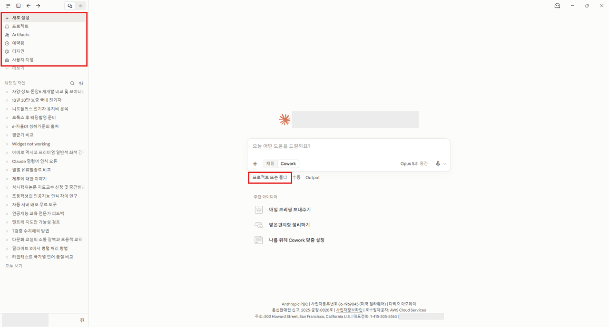
- 입력창 안: **+**(파일, 커넥터 등 추가) · **채팅 / Cowork** 전환 · 모델(Opus 5.5 중간) · 받아쓰기
- 입력창 아래: **프로젝트 또는 폴더 · 수동 · Output**, 그 아래 '추천 아이디어'(매일 브리핑 보내주기 / 받은편지함 정리하기 / 나를 위해 Cowork 맞춤 설정)
- 주의: '추천 아이디어'는 누르면 바로 일이 시작될 수 있어요. 연수에선 누르지 않게 안내하세요. 폴더 작업을 하려면 **Cowork** 쪽이 선택돼 있어야 해요.
- '더보기'를 누르면 **사이드바 편집…** 하나만 나와요(`10b_sidebar_more`).

**2-2. 프로젝트 또는 폴더 = 내 컴퓨터에 초대하기** — 누르면 내 프로젝트 목록과 **새 프로젝트 · 폴더 추가** 가 나와요. 실습 폴더는 **폴더 추가** 로 고르세요.
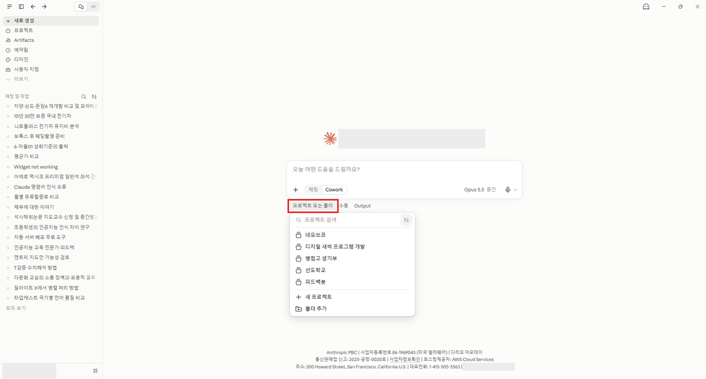
- 주의: 목록의 프로젝트 이름은 강사 계정 것이에요. 선생님 화면에는 비어 있을 수 있어요.

**2-3. + 메뉴 (파일, 커넥터 등 추가)** — 파일 또는 사진 추가 · 스킬 녹화하기 · 스킬 · 커넥터 · 디자인 시스템 · 플러그인 추가 · 메모리(켜기/끄기)
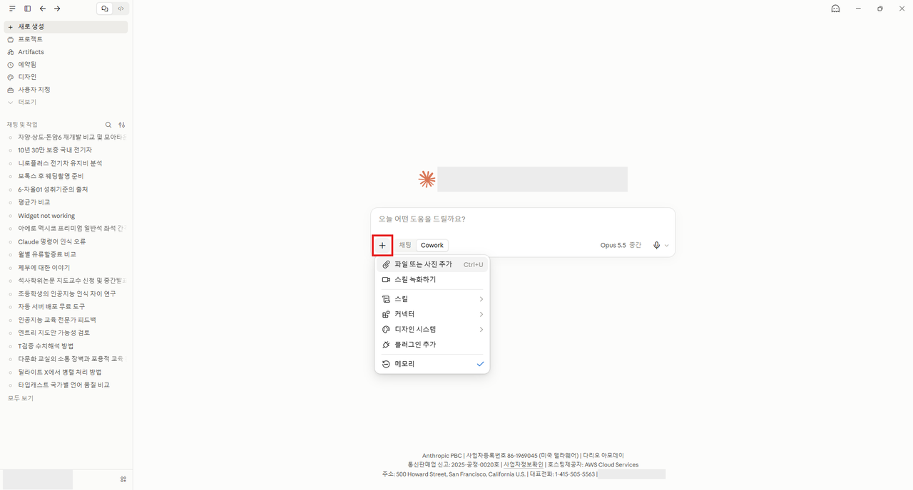

**2-4. Output (결과물 형식)** — Claude Docs(베타) · Claude Slides(베타) · Claude Design(베타) · Google Docs · Google Sheets · Google Slides · Artifact(Let Claude pick the format)
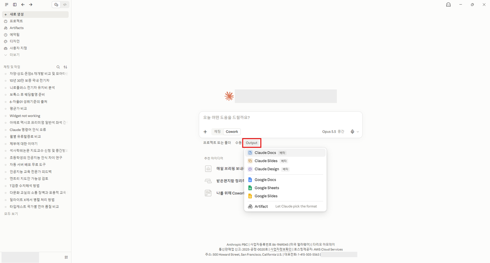
- 주의: 한글(hwp) 파일은 목록에 없어요. 한글 문서는 폴더 작업으로 파일을 만들게 하거나 inline AI를 쓰세요. [확인 필요]

**2-5. 모델 고르기** — Fable 5.1(가장 어려운 과제를 위해) · Opus 5.5(복잡한 작업과 일상 업무를 위해) · Sonnet 5.5(간단한 작업에 가장 효율적) · Haiku 4.5(가장 빠른 답변) · 노력 · 더 많은 모델
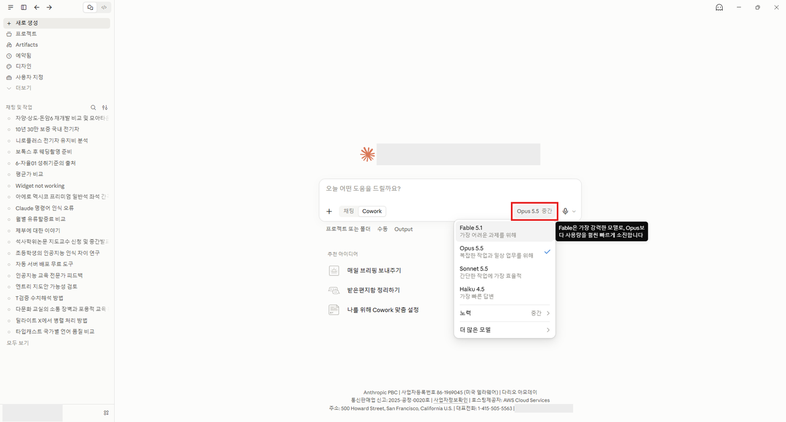

**2-6. 노력(생각 깊이)** — 모델 메뉴의 **노력 ›** : 낮음 · 중간(추천) · 높음 · 엑스트라 · 최대(6× 이상 사용량). 안내문: "더 높은 노력은 더 철저한 응답을 의미하지만, 시간이 더 오래 걸리고 한도를 더 빨리 사용합니다."
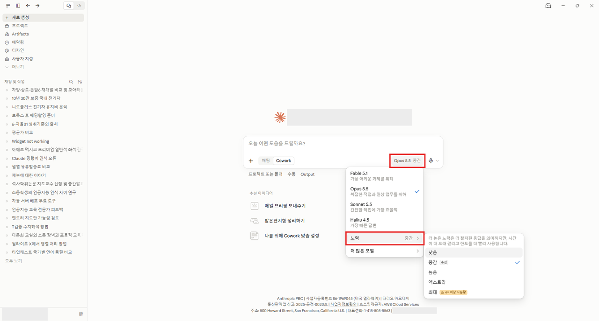
- 주의: **중간(추천)** 그대로 두세요. 높일수록 사용량이 빨리 닳아요.

**2-7. 권한 (수동/자동)** — 입력창 아래 **수동** 을 누르면: **수동 승인**("Claude가 각 작업을 승인할 수 있도록 일시 중지합니다.") · **자동 승인** · **모든 승인 건너뛰기**
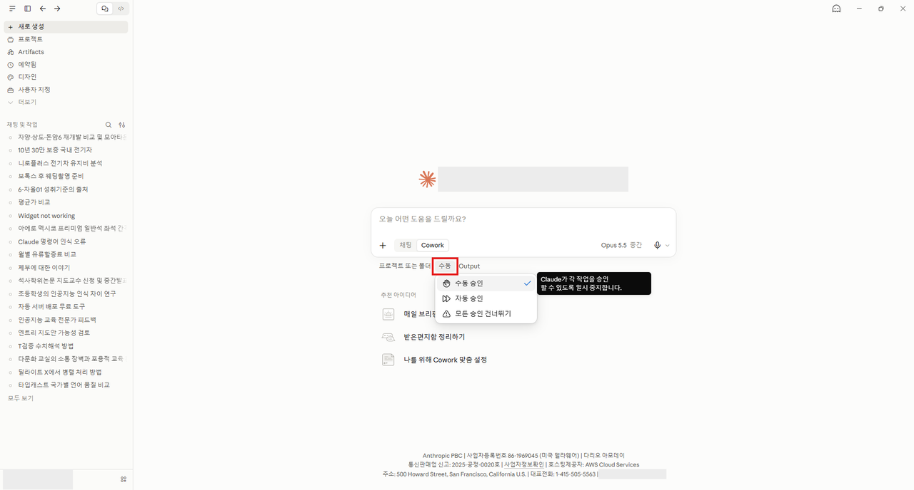
- 주의: 연수에서는 꼭 **수동 승인**. inline AI의 '편집 전 확인하기'와 같은 역할이에요.

**2-8. 프로젝트 목록** — 사이드바 **프로젝트**: 프로젝트 검색 · 정렬 · **새 프로젝트**
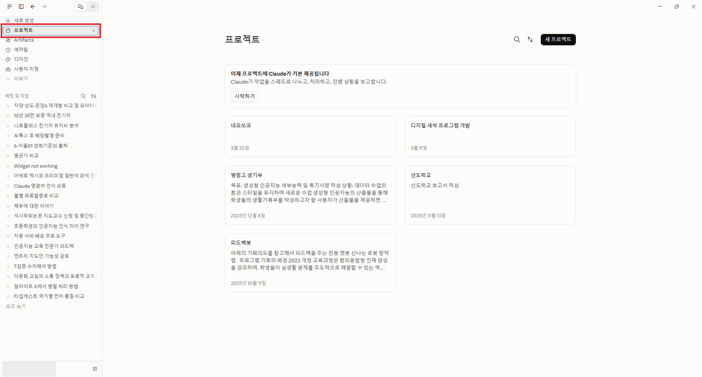

**2-9. 프로젝트 안 — 지침·컨텍스트(파일)** — 프로젝트를 열면 오른쪽에 **지침**(Claude의 응답을 맞춤화할 지침을 추가하세요), **메모리**, **컨텍스트**(파일 추가, 프로젝트 용량 %)가 있어요. 입력창 아래는 '프로젝트 또는 폴더' 대신 **폴더 추가** 로 바뀌어요.
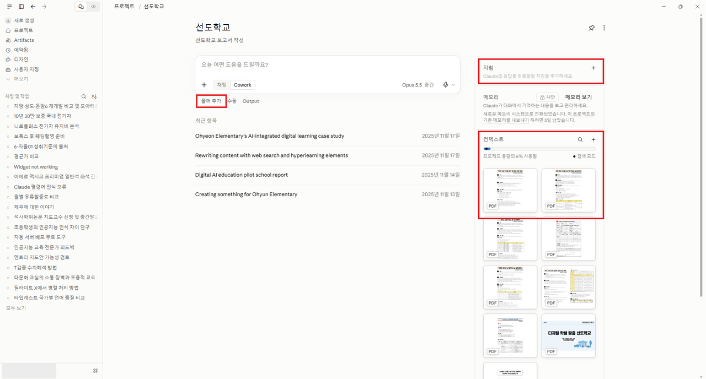
- 활용: 학교 양식·작년 문서를 컨텍스트에 넣고, 지침에 하네스 짧은판을 붙이면 "우리 학교 업무 방"이 돼요.

**2-10. 예약됨** — 제목 '예약된 작업'("일정에 따라 또는 필요할 때마다 작업을 실행하세요."), **새 작업** 버튼, 예시 카드(일일 브리핑 · 받은 편지함 분류 · 회의 준비 · 주간 요약 · 콘텐츠 아이디어 · 주제 모니터링)
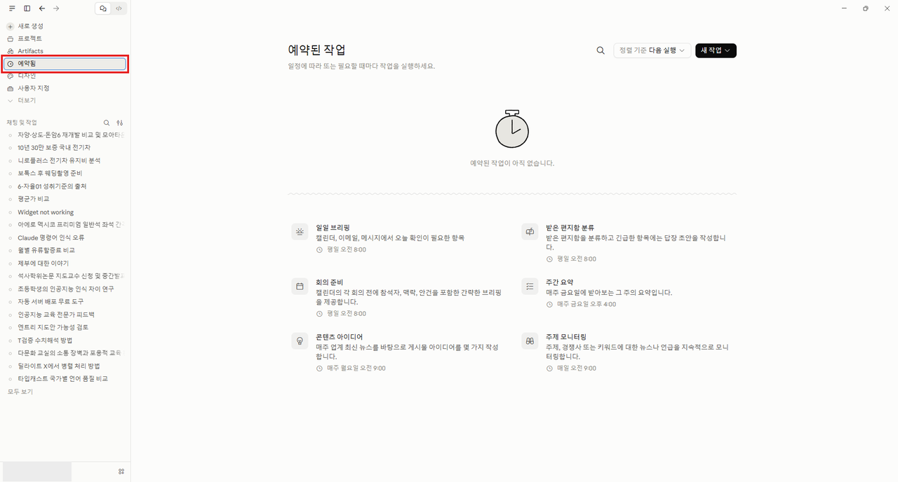
- 주의: 예시 카드는 누르면 예약 작업이 만들어질 수 있어요. 보여 주기만 하세요.

**2-11. 사용자 지정 → 스킬** — 위쪽 탭 **스킬 · 커넥터 · 플러그인**, 보기 **내 항목 / 탐색**, 오른쪽 **+ 추가**(스킬 추가)
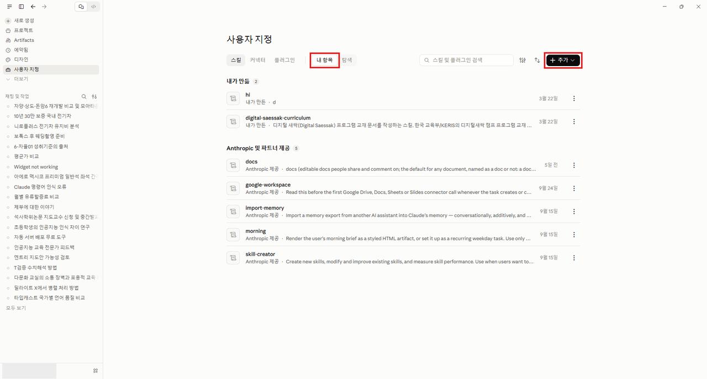
- '탐색' 화면: `23_customize`

**2-12. 스킬 추가 메뉴** — **스킬 업로드 · 스킬 만들기 · Claude로 만들기 · 화면 녹화**
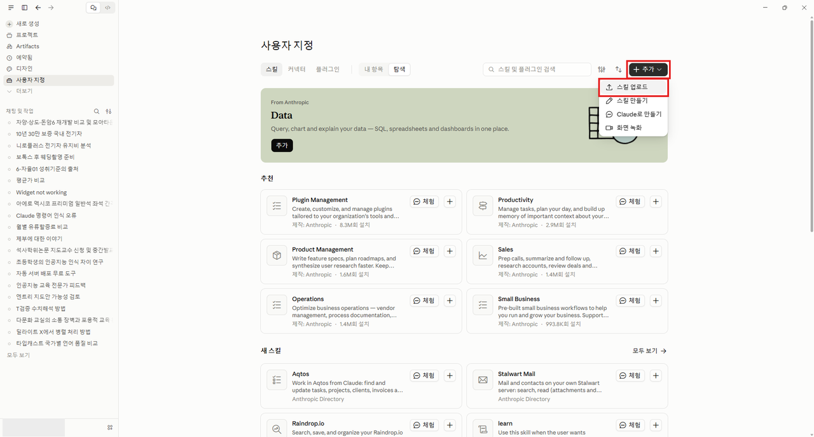

**2-13. 스킬 업로드 화면** — "워크스페이스에 스킬을 추가하세요. 업로드하면 보안 검사가 실행됩니다." 파일을 끌어다 놓거나 찾아보기. 조건: ".md 파일에는 YAML 형식의 스킬 이름과 설명이 포함되어야 합니다", ".zip 또는 .skill 파일에는 SKILL.md 파일이 포함되어야 합니다". 아래 **업로드 / 취소**.
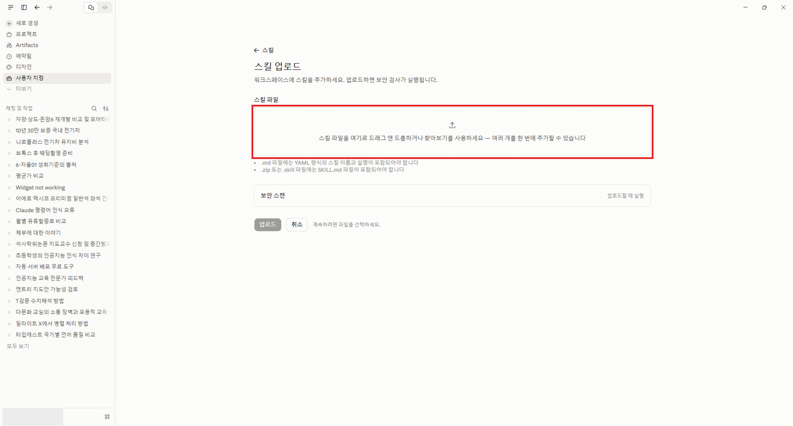
- 이번 캡처는 **취소** 로 닫았어요(업로드 안 함).

**2-14. 사용자 지정 → 커넥터** — 탐색 화면(추천, 인기 커넥터: Google Drive · Gmail · Google Calendar …)과 내 항목(커넥터 · 유형 · 상태, 연결 버튼)
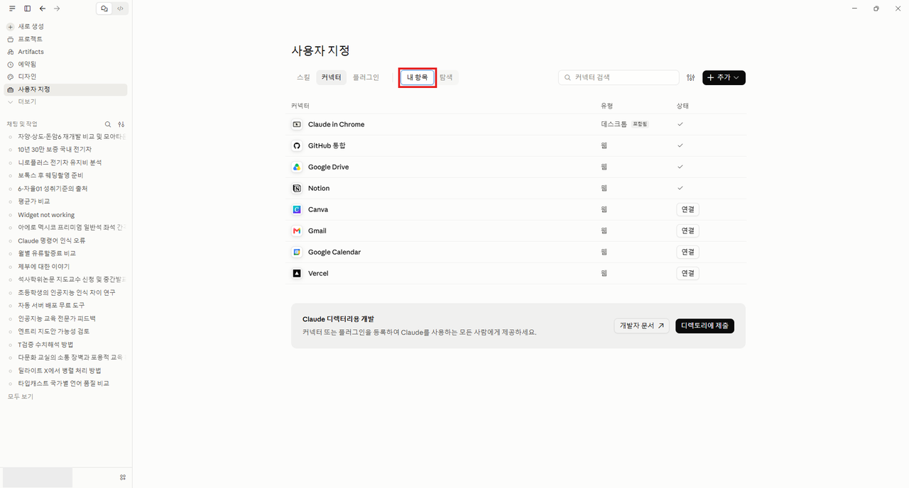
- 탐색 화면: `26_connectors`

**2-15. Artifacts · 디자인** — 만든 결과물 모음. "Claude Design이 이제 여기에 있습니다 — 새 Slides 및 Design 프로젝트는 아티팩트로 생성됩니다." 'Make something new'에 Docs(Beta), Slides(Beta) 등.
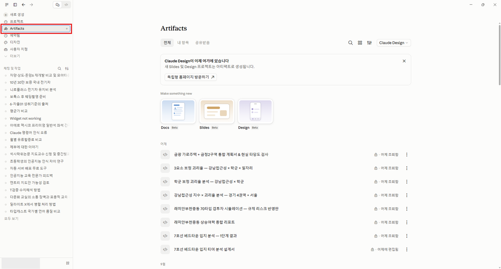
- 디자인: `28_design`

**2-16. 설정 들어가기** — 왼쪽 아래 계정 이름 → 메뉴: **설정(Ctrl+,) · 사용량 · 언어 · 도움 받기 · 플랜 업그레이드 · 앱 및 확장 프로그램 다운로드 · 자세히 알아보기 · 로그아웃**
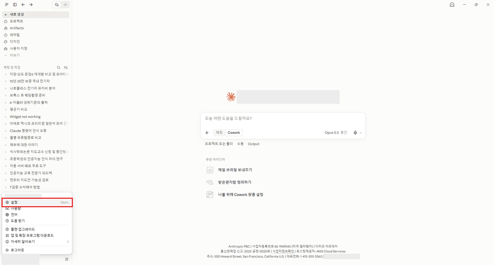
- 설정 창 왼쪽 메뉴
  - 설정: 일반 · 계정 · 개인정보보호 · 결제 · 사용량 · 기능 · 메모리 · 디자인 시스템 · 회고 · 시간 및 집중 · Claude Code · Cowork · Chrome용 Claude
  - 이 컴퓨터: 시스템 · 확장 프로그램 · 개발자
  - 사용자 지정: 스킬 · 커넥터 · 플러그인
- 일반 화면: `31_settings_first`

**2-17. 설정 → 계정 → Claude 지침** — inline AI의 '지시사항' 자리예요. "Claude는 Anthropic의 가이드라인 내에서 채팅과 Cowork 전반에 걸쳐 … 이를 기억합니다."
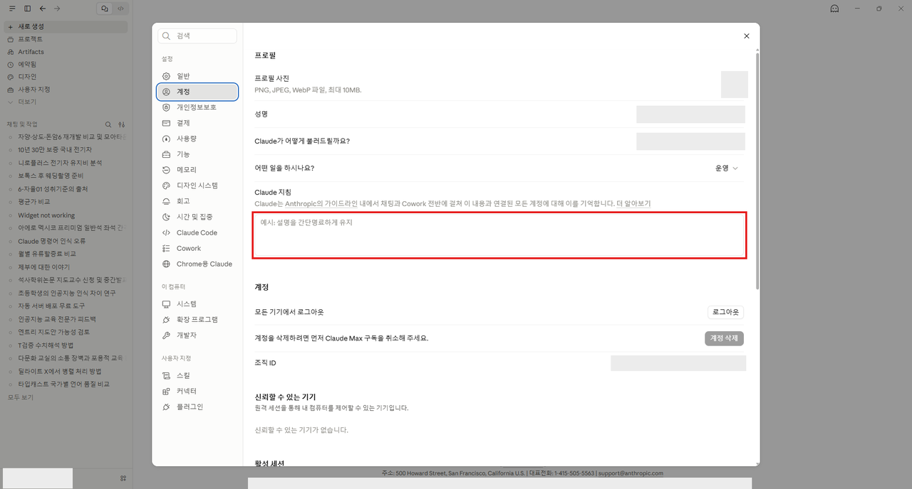
- 같은 화면: 프로필 사진 · 성명 · Claude가 어떻게 불러드릴까요? · 어떤 일을 하시나요? · 모든 기기에서 로그아웃 · 계정 삭제 · 조직 ID · 신뢰할 수 있는 기기 · 활성 세션
- 주의: 로그아웃·계정 삭제 버튼이 같은 화면에 있어요.

**2-18. 설정 → 개인정보보호 → Help improve our AI models** — "Allow the use of your chats and coding sessions to train and improve Anthropic AI models." (화면에 영어로 표시됨)
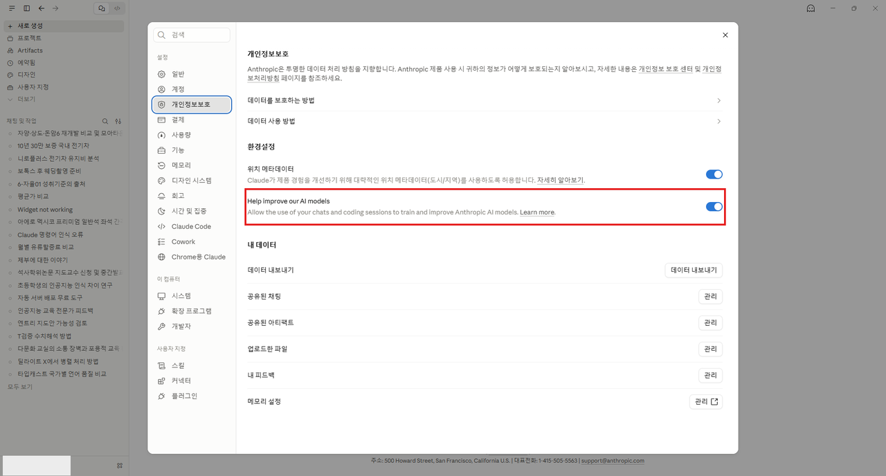
- 같은 화면: 위치 메타데이터 · 데이터 내보내기 · 공유된 채팅 · 공유된 아티팩트 · 업로드한 파일 · 내 피드백 · 메모리 설정
- 주의: 학교 자료를 다룬다면 이 스위치를 **끄는 것**을 권해요(이번 캡처에서는 바꾸지 않음).

**2-19. 설정 → 기능 → 코드 실행 및 파일 생성** — **클라우드 코드 실행 및 파일 생성**: "Claude가 서버에서 코드를 실행하고 문서, 스프레드시트, 프레젠테이션, PDF, 데이터 보고서를 생성하고 편집할 수 있습니다. 스킬 사용에 필요합니다."
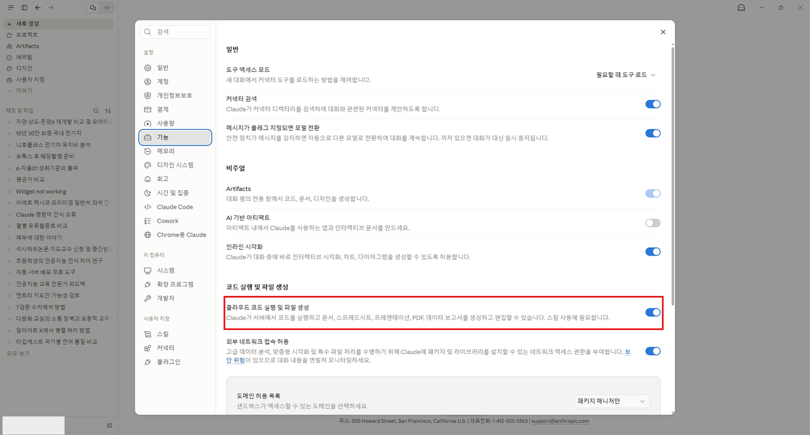
- 같은 화면: 도구 액세스 모드 · 커넥터 검색 · 메시지가 플래그 지정되면 모델 전환 · Artifacts · AI 기반 아티팩트 · 인라인 시각화 · 외부 네트워크 접속 허용 · 도메인 허용 목록
- 주의: 스킬을 쓰려면 이 스위치가 켜져 있어야 해요.

**2-20. 설정 → 메모리** — 메모리는 '기능'이 아니라 **별도 메뉴**예요. 채팅 검색 및 참조 · 채팅에서 메모리 생성 · 민감한 주제를 메모리에 포함 · 다른 AI 제공업체에서 메모리 가져오기, 아래에 저장된 메모리 목록
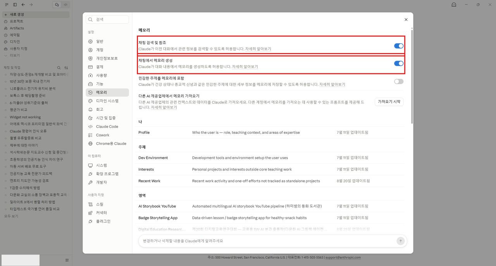

**2-21. 설정 → 시스템 → 컴퓨터 사용(베타)** — **컴퓨터 사용 활성화**: "Claude가 허용한 앱에서 작업할 수 있도록 화면, 마우스, 키보드에 대한 제어권을 Claude에게 부여하세요." 위쪽: 데스크톱 앱 버전 · 시작 시 실행 · 빠른 입력 키보드 단축키(Ctrl+Alt+Space) · 음성 입력 단축키 · 시스템 트레이 · 컴퓨터 절전 모드 방지 · 저장 공간 · 브라우저 사용
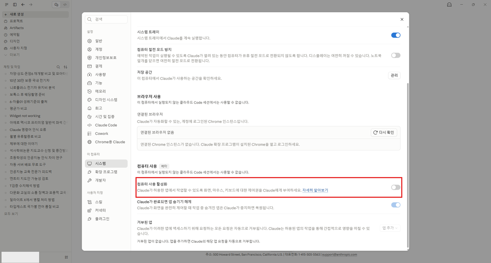
- 주의: 연수에서는 켜지 않아요(화면 조작 권한).

---

## 3. 공문서 하네스를 스킬로 올리기

1. `materials/00_하네스_공문서/클로드_스킬용` 폴더를 확인해요. 안에 `SKILL.md` 와 `references/`(03~07 파일)가 있어요.
2. 폴더를 **zip으로 압축**해요. 업로드 화면 조건: ".zip 또는 .skill 파일에는 SKILL.md 파일이 포함되어야 합니다".
3. 클로드 앱 **사용자 지정 → 스킬 → + 추가 → 스킬 업로드** (2-11~2-13 화면)
4. zip을 끌어다 놓고 **업로드**. 업로드하면 보안 검사가 실행돼요.
5. **내 항목** 목록에 `school-official-docs` 가 보이는지 확인해요.
6. **설정 → 기능 → 클라우드 코드 실행 및 파일 생성** 이 켜져 있는지 확인해요("스킬 사용에 필요합니다").
7. "작년 계획서 올해로 바꿔 줘"처럼 시키면 스킬이 저절로 쓰여요.
- [캡처 필요] 실제 zip을 올린 뒤 목록에 나타난 화면 — 업로드는 금지라 이번에 찍지 않았어요.

---

## 4. inline AI ↔ 클로드 코워크 비교 (상위 호환인 이유)

| | inline AI | 클로드 코워크 |
|---|---|---|
| 폴더 초대(내 컴퓨터 파일 맡기기) | ✅ 작업 패널 → 접근 가능한 폴더 | ✅ 프로젝트 또는 폴더 → 폴더 추가 |
| 양식 주기(우리 학교 양식 그대로) | ✅ | ✅ |
| "목록 먼저, 아직 하지 마" | ✅ 편집 전 확인하기 | ✅ 수동 승인 |
| 늘 쓰는 규칙 저장 | 일반 설정 → inline AI 지시사항 | 설정 → 계정 → Claude 지침, 프로젝트 지침 + **스킬**(규칙 파일 묶음) |
| 프로젝트(자료 묶음별 작업 공간) | ✖ | ✅ |
| 예약(정해진 시간에 자동으로) | ✖ | ✅ |
| 커넥터(드라이브·메일·캘린더 연결) | ✖ | ✅ |
| 한글(hwp) 문서 **직접** 편집 | ✅ 한/글 편집 모드가 편함 | △ 파일로 만들어 주지만 한글 창을 직접 고치진 않음 [확인 필요] |
| 비용 | Free 플랜 월 500크레딧(10/5 화면 기준) | **유료(Pro 이상)** 필요 |
| 설치 | Windows 앱 | 클로드 **데스크톱 앱** 필요(웹만으로는 폴더 작업 불가 [확인 필요]) |

한 줄 정리: "inline AI에서 배운 세 가지(일단 던지기·내 컴퓨터에 초대·양식 주기)는 그대로 쓰고, 클로드는 거기에 **프로젝트·스킬·예약·커넥터**가 더해져요. 다만 한글 직접 편집은 inline AI가 더 편해요."

---

## 5. 더 볼 영상 — 전정선 선생님 (교육티타임)

### 대표 영상 (1순위, 강사 확정)
「"교무행정·수업 기획 끝판왕" 교사를 위한 최신 클로드(Claude) 활용법 완전 정복! (feat. 전정선 선생님)」 — 채널 교육티타임 · 2026. 7. 1. · 1:22:33 · 영상 ID `HmBVZ_679Ko`
https://www.youtube.com/watch?v=HmBVZ_679Ko

```html
<iframe width="560" height="315" src="https://www.youtube.com/embed/HmBVZ_679Ko" title="교사를 위한 최신 클로드 활용법 (전정선)" frameborder="0" allow="accelerometer; clipboard-write; encrypted-media; gyroscope; picture-in-picture" allowfullscreen></iframe>
```

주요 장면 (강의 스크립트 기준 **추정 시각** — 강의 전 재생해서 [확인 필요])

| 장면 | 시각 | 바로 가기 |
|---|---|---|
| 스킬 만들기 | 약 17:30 | https://www.youtube.com/watch?v=HmBVZ_679Ko&t=1050s |
| 스킬 업로드 | 약 21:40 | https://www.youtube.com/watch?v=HmBVZ_679Ko&t=1300s |
| 코워크 소개 | 약 37:40 | https://www.youtube.com/watch?v=HmBVZ_679Ko&t=2260s |
| 폴더 지정·공문 정리 시연 | 약 53:50 | https://www.youtube.com/watch?v=HmBVZ_679Ko&t=3230s |
| 자동화 5단계 | 약 1:12:40 | https://www.youtube.com/watch?v=HmBVZ_679Ko&t=4360s |

임베드에서 특정 장면부터 틀려면 `https://www.youtube.com/embed/HmBVZ_679Ko?start=1300` 처럼 `?start=초`를 붙여요.

### 보조 영상

| 제목 | 올린 날 | 길이 | 영상 ID | 링크 |
|---|---|---|---|---|
| 클로드 코워크 실전 활용법!! 생기부 작성에 활용하는 꿀팁 포함! (feat. 전정선 선생님) | 2026. 7. 15. | 1:20:15 | AFVEpW0-X8U | https://www.youtube.com/watch?v=AFVEpW0-X8U |
| 교사 업무, 클로드 코워크로 어디까지 가능할까? \| 전정선 선생님 | 2026. 10. 1.(한국 시간, 미국 시간 9. 30.) | 1:23:31 | AgLuARcXnbI | https://www.youtube.com/watch?v=AgLuARcXnbI |

```html
<iframe width="560" height="315" src="https://www.youtube.com/embed/AFVEpW0-X8U" title="클로드 코워크 실전 활용법 (전정선)" frameborder="0" allow="accelerometer; clipboard-write; encrypted-media; gyroscope; picture-in-picture" allowfullscreen></iframe>
<iframe width="560" height="315" src="https://www.youtube.com/embed/AgLuARcXnbI" title="교사 업무, 클로드 코워크로 어디까지 (전정선)" frameborder="0" allow="accelerometer; clipboard-write; encrypted-media; gyroscope; picture-in-picture" allowfullscreen></iframe>
```

세 편 모두 채널 '교육티타임'의 실시간 강의 다시보기예요(YouTube 영상 페이지의 제목·날짜·길이로 확인). 연수 09 코워크 섹션에는 대표 영상을, 사이트 맨 아래 '더 볼거리'에는 보조 영상을 넣으세요.
